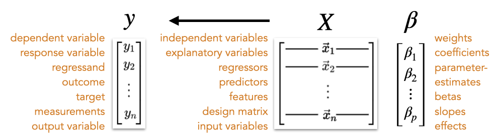

::: {.callout-tip title="How to Use This Reference"}
This is a **quick-lookup guide** for mathematical symbols you'll encounter in the course.

See also: [Common Formulas](formulas.qmd) | [Glossary](terminology.qmd)
:::

::: {.callout-note title="Notation conventions"}
Mathematical notation varies across fields:

- **Classical statistics** (explanation/inference culture) tends toward flexible notation that's changed over generations
- **Machine learning** (prediction/algorithmic culture) has converged on more standardized conventions (e.g. the [Goodfellow textbook](./Goodfellow_notation.pdf))

We'll primarily use **classical statistics notation** in this course, but you'll encounter ML-style notation in some readings. The key differences:

| Concept    | Classical Stats     | ML Convention                     |
| ---------- | ------------------- | --------------------------------- |
| Vectors    | $x$ or $\mathbf{x}$ | $\boldsymbol{x}$ (bold lowercase) |
| Matrices   | $X$ or $\mathbf{X}$ | $\boldsymbol{X}$ (bold uppercase) |
| Transpose  | $X'$ or $X^T$       | $\boldsymbol{X}^\top$             |
| Parameters | $\beta$             | $\boldsymbol{\theta}$ (often)     |

:::

## Numbers and Variables

| Symbol        | Meaning                                   | Example                  |
| ------------- | ----------------------------------------- | ------------------------ |
| $x$, $y$, $z$ | Variables (scalar values)                 | $x = 5$                  |
| $x_i$         | The $i$th observation of variable $x$     | $x_3$ = third data point |
| $n$           | Sample size (number of observations)      | $n = 100$ participants   |
| $p$           | Number of predictors                      | 3 predictors → $p = 3$   |
| $i$, $j$, $k$ | Index variables (for counting/subscripts) | $\sum_{i=1}^{n}$         |

## Vectors and Matrices

| Symbol       | Meaning                                        | Dimensions   |
| ------------ | ---------------------------------------------- | ------------ |
| $\mathbf{x}$ | A vector (ordered list of numbers)             | $n \times 1$ |
| $\mathbf{X}$ | A matrix (2D array of numbers)                 | $n \times p$ |
| $\mathbf{y}$ | Outcome vector (all $y$ values)                | $n \times 1$ |
| $\mathbf{I}$ | Identity matrix (1s on diagonal, 0s elsewhere) | $n \times n$ |

## Common Descriptive Statistics Symbols

| Symbol                | Name            | Meaning                       |
| --------------------- | --------------- | ----------------------------- |
| $\bar{x}$             | "x-bar"         | Sample mean of $x$            |
| $\mu$                 | "mu"            | Population mean               |
| $s^2$ or $\sigma^2_x$ | —               | Sample variance               |
| $\sigma^2$            | "sigma squared" | Population variance           |
| $s$ or $\sigma_x$     | —               | Sample standard deviation     |
| $\sigma$              | "sigma"         | Population standard deviation |
| $SE$                  | —               | Standard error                |

## Hats, Bars, and Other Decorations

| Symbol        | Name       | Meaning                                         |
| ------------- | ---------- | ----------------------------------------------- |
| $\bar{x}$     | "x-bar"    | Mean of $x$                                     |
| $\hat{y}$     | "y-hat"    | Predicted/fitted value of $y$                   |
| $\hat{\beta}$ | "beta-hat" | Estimated coefficient (from data)               |
| $\tilde{x}$   | "x-tilde"  | Sometimes used for median or transformed values |

::: {.callout-tip title="The Hat Rule"}
A **hat** ($\hat{\ }$) almost always means "estimated from data."

- $\beta$ = the true (unknown) population parameter
- $\hat{\beta}$ = our estimate of $\beta$ from the sample
:::

### Subscript and Superscript Patterns

| Pattern     | Meaning                              | Example                                   |
| ----------- | ------------------------------------ | ----------------------------------------- |
| $x_i$       | Observation $i$                      | $x_3$ = 3rd observation                   |
| $x_{ij}$    | Observation $i$, variable $j$        | $x_{5,2}$ = 5th person, 2nd variable      |
| $\beta_j$   | Coefficient for predictor $j$        | $\beta_2$ = coefficient for 2nd predictor |
| $\bar{x}_j$ | Mean of variable $j$                 | $\bar{x}_1$ = mean of first variable      |
| $x^2$       | $x$ squared                          | —                                         |
| $x^{(k)}$   | Sometimes: $k$th iteration or sample | Used in bootstrapping                     |

### Set Notation (Occasionally Used)

| Symbol       | Meaning                              | Example                                   |
| ------------ | ------------------------------------ | ----------------------------------------- |
| $\in$        | "is an element of"                   | $x \in \mathbb{R}$ ($x$ is a real number) |
| $\mathbb{R}$ | The real numbers                     | —                                         |
| $\{0, 1\}$   | A set containing 0 and 1             | Binary outcomes                           |
| $[a, b]$     | Interval from $a$ to $b$ (inclusive) | $x \in [0, 1]$                            |

## Greek Letters in Statistics

| Letter     | Name          | Typical Use                                           |
| ---------- | ------------- | ----------------------------------------------------- |
| $\alpha$   | alpha         | Significance level (e.g., $\alpha = 0.05$)            |
| $\beta$    | beta          | Regression coefficient; also Type II error rate       |
| $\gamma$   | gamma         | Effect size; group-level coefficients in mixed models |
| $\epsilon$ | epsilon       | Error/residual term                                   |
| $\mu$      | mu            | Population mean                                       |
| $\sigma$   | sigma         | Standard deviation                                    |
| $\sigma^2$ | sigma-squared | Variance                                              |
| $\rho$     | rho           | Population correlation                                |
| $\tau$     | tau           | Kendall's tau; random effect variance                 |
| $\chi^2$   | chi-squared   | Chi-squared distribution/statistic                    |

#### Less Common (but you'll see them)

| Letter    | Name          | Typical Use                                     |
| --------- | ------------- | ----------------------------------------------- |
| $\lambda$ | lambda        | Eigenvalue; regularization parameter            |
| $\theta$  | theta         | Generic parameter (common in ML)                |
| $\pi$     | pi            | Probability (especially in logistic regression) |
| $\phi$    | phi           | Various (correlation for binary variables)      |
| $\Sigma$  | capital sigma | Covariance matrix                               |

## Operators and Operations

### Summation

$$\sum_{i=1}^{n} x_i = x_1 + x_2 + \cdots + x_n$$

Read as: "Sum of $x_i$ from $i=1$ to $n$" — add up all $n$ values.

### Product

$$\prod_{i=1}^{n} x_i = x_1 \times x_2 \times \cdots \times x_n$$

Read as: "Product of $x_i$ from $i=1$ to $n$" — multiply all $n$ values.

### Matrix Operations

| Symbol                          | Name                  | Meaning                                    |
| ------------------------------- | --------------------- | ------------------------------------------ |
| $\mathbf{X}^T$ or $\mathbf{X}'$ | Transpose             | Flip rows and columns                      |
| $\mathbf{X}^{-1}$               | Inverse               | Matrix that "undoes" $\mathbf{X}$          |
| $\mathbf{AB}$                   | Matrix multiplication | Multiply matrices $A$ and $B$              |
| $\mathbf{X}^\top\mathbf{X}$     | Gram matrix           | $\mathbf{X}$ transposed times $\mathbf{X}$ |
| $\|\mathbf{x}\|$                | Norm                  | Length/magnitude of vector $\mathbf{x}$    |
| $\det(\mathbf{A})$              | Determinant           | Scalar summarizing matrix $\mathbf{A}$     |

## Probability and Distributions

| Symbol                    | Meaning                           | Example                                  |
| ------------------------- | --------------------------------- | ---------------------------------------- |
| $P(A)$                    | Probability of event $A$          | $P(\text{heads}) = 0.5$                  |
| $p(x)$                    | Probability density/mass function | $p(x) = \frac{1}{\sqrt{2\pi}}e^{-x^2/2}$ |
| $X \sim N(\mu, \sigma^2)$ | "$X$ is distributed as Normal"    | $X \sim N(0, 1)$                         |
| $E[X]$ or $\mathbb{E}[X]$ | Expected value of $X$             | $E[X] = \mu$                             |
| $\text{Var}(X)$           | Variance of $X$                   | $\text{Var}(X) = \sigma^2$               |
| $\text{Cov}(X, Y)$        | Covariance of $X$ and $Y$         | —                                        |

::: {.callout-note title="The Tilde (~)"}
The symbol $\sim$ means "is distributed as."

$\epsilon \sim N(0, \sigma^2)$ reads: "epsilon is distributed as Normal with mean 0 and variance sigma-squared."
:::

## Regression Notation

| Symbol                     | Meaning                                             |
| -------------------------- | --------------------------------------------------- |
| $y$                        | Outcome/dependent variable (one observation)        |
| $\mathbf{y}$               | Vector of all outcomes                              |
| $x$                        | Predictor/independent variable (one value)          |
| $\mathbf{X}$               | Design matrix (all predictors for all observations) |
| $\beta_0$                  | Intercept                                           |
| $\beta_1, \beta_2, \ldots$ | Slope coefficients                                  |
| $\boldsymbol{\beta}$       | Vector of all coefficients                          |
| $\hat{y}$                  | Predicted value                                     |
| $e$ or $\hat{\epsilon}$    | Residual ($y - \hat{y}$)                            |
| $\epsilon$                 | Error term (population)                             |

{width=85% fig-align="center"}

::: {.callout-note title="Rows vs. Columns"}
In statistics, we typically organize data as:

- **Rows** = observations (one per participant/trial)
- **Columns** = variables (one per measurement)

So a design matrix $\mathbf{X}$ with 100 participants and 3 predictors is $100 \times 3$.
:::

