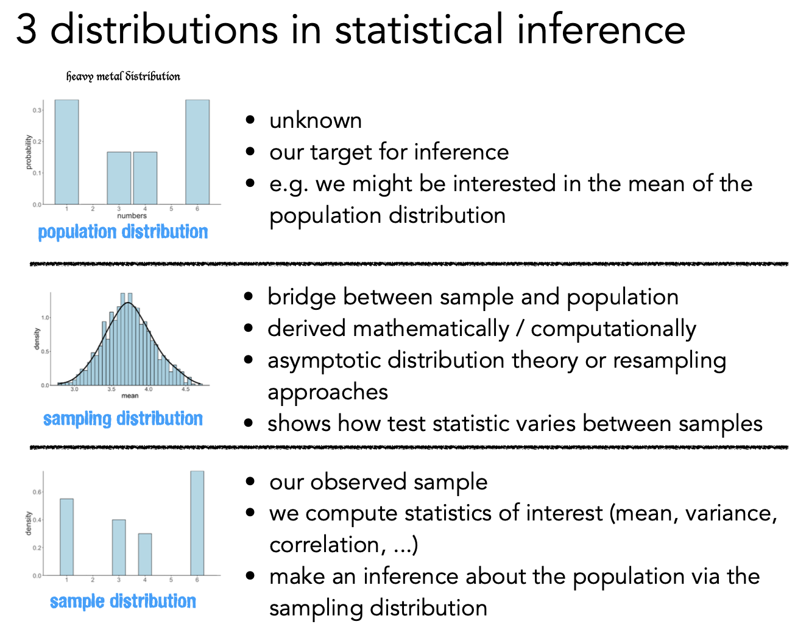
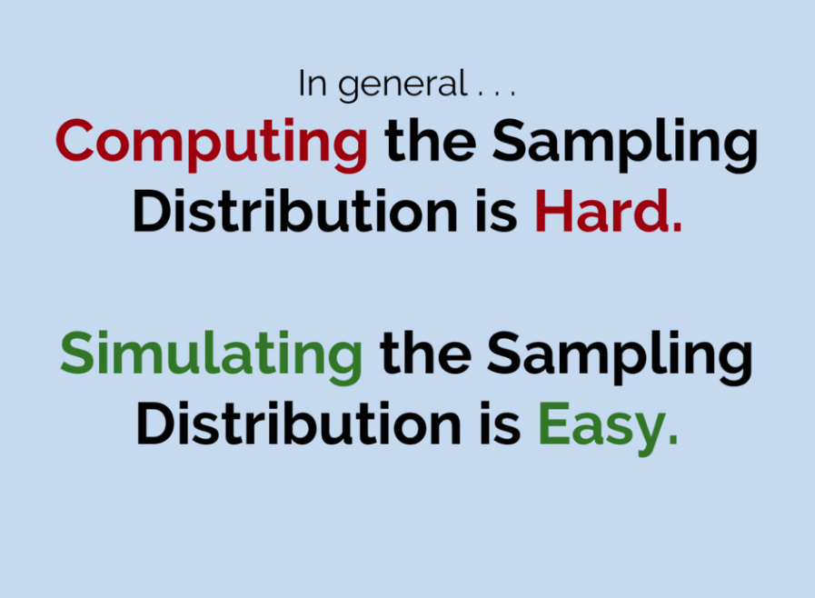

In this notebook, we'll explore one of the most important concepts in statistics: the **sampling distribution**. Understanding sampling distributions is key to understanding *where uncertainty comes from* and *how we can quantify it*.

We'll learn two powerful computational approaches:
1. **Monte Carlo Simulation** - generating synthetic data from *assumed* distributions
2. **Bootstrap** - resampling from *actual* data with replacement

Then we'll combine them in a **power analysis** to answer: *"How many observations do we need to reliably detect an effect?"*

By the end of this notebook, you'll understand why Jake VanderPlas says: **"If you can write a for-loop, you can do statistics."**

:::{.callout-tip title="Explorable Interactives"}
This notebook includes **interactive widgets** you can play with to build intuitions *before* writing any code. Drag sliders, change parameters, and watch what happens!
:::

```{python .marimo}
import marimo as mo
import polars as pl
import seaborn as sns
import numpy as np
```

## (1) Estimators & Loss Functions

<!---->
Before we can simulate or resample, we need to **fit estimators** to our data. Remember from this week's lectures:

- An **estimator** is a rule for calculating an estimate from data
- The **mean** minimizes Sum of Squared Errors (SSE)
- The **median** minimizes Sum of Absolute Errors (SAE)

Different estimators make different **assumptions** about what "error" means — and these assumptions are captured in their **loss functions**.

Each estimator minimizes a specific **loss function**:

$$\text{SSE} = \sum_{i=1}^{n} (x_i - \hat\theta)^2 \qquad \text{SAE} = \sum_{i=1}^{n} |x_i - \hat\theta|$$

The mean minimizes SSE; the median minimizes SAE. **Drag the slider** below to verify this yourself:

```{python .marimo hide_code="true"}
from helpers import loss_explorer
_loss_widget = mo.ui.anywidget(loss_explorer())
_loss_widget
```

:::{.callout-note title="Key Insight: Loss Functions Define Estimators"}
Notice how:
- The **red curve (SSE)** reaches its minimum at the **mean**
- The **blue curve (SAE)** reaches its minimum at the **median**

This isn't coincidence — it's *mathematical necessity*. The estimator we choose reflects our assumptions about what kind of errors matter most:
- **SSE**: Penalizes large errors heavily (squared), making the mean sensitive to outliers
- **SAE**: Treats all errors proportionally, making the median robust to outliers
:::

<!---->
## (2) Three Big Ideas

<!---->
### (2.1) Central Limit Theorem (CLT)

The CLT says: regardless of the population's shape, the **sampling distribution of an estimator** becomes approximately normal as sample size grows.

Try it yourself — pick a non-normal distribution (e.g., Exponential or Bimodal), then click **Draw Samples** to watch the sampling distribution emerge:

```{python .marimo hide_code="true"}
from helpers import clt_explorer

_clt_widget = mo.ui.anywidget(clt_explorer())
_clt_widget
```

:::{.callout-tip title="Tip: Your Turn"}
Try different combinations and click **Draw Samples** repeatedly to build up the distribution:

- Are there distributions and estimators that don't quite converge to normal?
- Play with the size of each sample **and** the number of **draws** (simulations). How does each effect the outcome?
:::

<!---->
### (2.2) Law of Large Numbers (LLN)

The LLN says: **as we increase the number of independent observations, a sample estimator converges to the theoretical population estimator**

The widget below uses synthetic heavy-tailed data (t-distribution, df=3) — perfect for seeing wild early fluctuations that eventually settle down. **Drag the slider** to see this in action:

```{python .marimo hide_code="true"}
from helpers import lln_explorer

_lln_widget = mo.ui.anywidget(lln_explorer())
_lln_widget
```

:::{.callout-note title="Key Takeaway: LLN"}
Notice how the running average (blue line) bounces wildly at small sample sizes but settles down as n grows. The red band shows the *expected range* based on σ/√n — the theoretical standard error. This is why larger samples give more precise estimates.
:::

<!---->
### (2.3) No Free Lunch

We've seen that the mean minimizes SSE and the median minimizes SAE. But which estimator is *better*?

The **No Free Lunch** principle says: **it depends on the data.** No single estimator is universally optimal. Switch between distributions below and watch the winner change:

```{python .marimo hide_code="true"}
from helpers import nfl_explorer

_nfl_widget = mo.ui.anywidget(nfl_explorer())
_nfl_widget
```

:::{.callout-note title="Key Takeaway: No Free Lunch"}
- For **symmetric** data (Normal), the mean is more *efficient* (lower RMSE)
- For **heavy-tailed** data (t, df=3), the median is more *robust* (less affected by extreme values)
- For **skewed** data (Exponential), the difference depends on sample size

**Every estimator embodies assumptions defined by their loss-functions** — and those assumptions can help or hurt depending on the data. There is no universally "best" estimator. This is why understanding your data matters!
:::

<!---->
## The Key Distributions in Statistics

Before we dive into code, let's clarify three distributions that are easy to confuse:

| Distribution | What it is | What we know about it |
|--------------|------------|----------------------|
| **Population** | The true values in the world | Usually unknown (that's why we do statistics!) |
| **Sampling** | How our *estimates* vary across hypothetical samples | The bridge between sample and population |
| **Sample** | The data we actually collected | We can see and measure this |

The **sampling distribution** is the key concept. It answers: *"If I collected many datasets of the same size, how much would my estimate (mean, median, correlation, etc.) bounce around?"*



<!---->
:::{.callout-note title="Why does this matter?"}
The sampling distribution is **the uncertainty bridge**. It connects:
- What we *observed* (our sample)
- What we *want to know* (the population)

Standard errors, confidence intervals, and p-values all come from reasoning about the sampling distribution.
:::

Let's exploring the **sampling distribution** using 2 approaches we saw in "Statistics for Hackers"

<!---->
## (3.1) Monte-Carlo Simulation


<!---->
**Monte-Carlo simulation** uses random sampling from *assumed probability distributions* to understand statistical behavior.

The concept of Monte-Carlo simulation was devised by the mathematicians Stan Ulam and Nicholas Metropolis, who were working to develop an atomic weapon for the US as part of the Manhattan Project. They needed to compute the average distance that a neutron would travel in a substance before it collided with an atomic nucleus, but they could not compute this using standard mathematics. Ulam realized that these computations could be simulated using *random numbers*, just like a casino game.

In a casino game such as a roulette wheel, numbers are generated at random; to estimate the probability of a specific outcome, one could play the game hundreds of times. Ulam’s uncle had gambled at the Monte-Carlo casino in Monaco, which is apparently where the name came from for this technique.

Monte-Carlo asks: **"If the world worked like we assume, what would we expect to see?"**

We:
1. **Assume** a data-generating distribution (e.g., Normal)
2. **Use our estimates** (μ̂, σ̂) as the distribution parameters
3. **Simulate** synthetic data from that distribution
4. **Build** a sampling distribution to understand variability

Try it yourself — set the assumed parameters and click **Simulate** to build a sampling distribution:

```{python .marimo hide_code="true"}
from helpers import mc_explorer

_mc_widget = mo.ui.anywidget(mc_explorer())
_mc_widget
```

:::{.callout-note title="What just happened?"}
Each click draws **n** synthetic samples from a Normal(μ, σ) distribution, computes the mean of each, and adds them to the sampling distribution on the right.

Key things to notice:
- The sampling distribution is centered on **μ** (the true mean)
- The **Theoretical SE** (σ/√n) closely matches the **Simulated SE** — that's the CLT!
- Increasing **n** makes the distribution narrower (more precise estimates)
- Increasing **σ** makes it wider (more variable data = more uncertain estimates)
:::

<!---->
### Now let's build this in code with real data

Let's load our familiar penguins dataset and see how Monte Carlo simulation works step by step:

```{python .marimo}
penguins = pl.DataFrame(sns.load_dataset("penguins")).drop_nulls()
penguins.head()
```

We'll start by fitting some **estimators** given our **sample**:

- mean
- standard-deviation

```{python .marimo}
# Fit our estimators to the data
estimated_mean = penguins.select("flipper_length_mm").mean().item()
estimated_std = penguins.select("flipper_length_mm").std().item()
n_obs = penguins.height

print(f"Sample size: n = {n_obs}")
print(f"Estimated mean (μ̂): {estimated_mean:.2f} mm")
print(f"Estimated std (σ̂): {estimated_std:.2f} mm")
```

Before we run thousands of simulations, let's see what **one** looks like. We're going to use a function from the `numpy` library that randomly samples from a normal distrubtion:

```{python .marimo}
from numpy.random import normal
```

Try re-running the cell below multiple times. Notice how the simulated mean and std differ each time

```{python .marimo}
# Step by step: ONE Monte Carlo simulation
one_simulation = normal(loc=estimated_mean, scale=estimated_std, size=n_obs)
simulation_mean = one_simulation.mean()
simulation_std = one_simulation.std()

# Our estimated mean and std from data
print(f"Assumed distribution: Normal(μ={estimated_mean:.2f}, σ={estimated_std:.2f})\n")

print("Generated 50 synthetic observations")
print(f"Sample mean of this one simulation: {simulation_mean:.2f} mm")
print(f"Difference from assumed μ: {simulation_mean - estimated_mean:+.2f} mm")
print(f"Sample std of this one simulation: {simulation_std:.2f} mm")
print(f"Difference from assumed μ: {simulation_std - estimated_std:+.2f} mm")
```

Now we can repeat this over-and-over to build up the **sampling distribution** of our estimators. Let's focus on the mean for now:

```{python .marimo}
# The number of simulations
nsim = 1000

# Store results
simulated_means = []

# If you can loop you can do stats!
for i in range(nsim):

    # Simulate and calculate mean
    this_mean = normal(loc=estimated_mean, scale=estimated_std, size=n_obs).mean()

    # Save result
    simulated_means.append(this_mean)

# Covert to a dataframe to make it easier to work with
simulated_df = pl.DataFrame({
    "simulation" : range(nsim),
    "mean": simulated_means
})

# Check it out
simulated_df.head()
```

Now let's visualize this sampling distribution and connect it to the **Standard Error** formula:

$$\text{Standard Error (SE)} = \frac{\sigma}{\sqrt{n}} = \text{Standard Deviation (SD) of sampling-dist}$$

The SE tells us the standard deviation of the sampling distribution — how much our estimate "bounces around" across hypothetical samples. Let's calculate it:

```{python .marimo}
# Calculate theoretical SE using the formula
estimated_se = estimated_std / np.sqrt(n_obs)

# Calculate simulated SE (SD of our Monte Carlo distribution)
simulated_std = simulated_df.select("mean").std().item()

# Calculate 95% CI using z = 1.96
mc_ci_lower = estimated_mean - (1.96 * estimated_se)
mc_ci_upper = estimated_mean + (1.96 * estimated_se)

# Plot
_grid = sns.displot(
    data=simulated_df.to_pandas(),
    x='mean',
    kind='hist',
    bins=30,
    aspect=2
)
_grid.refline(x=estimated_mean, color='red', ls='--', lw=2)
_grid.ax.axvspan(mc_ci_lower, mc_ci_upper, alpha=0.2, color='green')
_grid.set(
    title=f'Monte Carlo Sampling Distribution (n={nsim})\nSE (estimated): {estimated_se:.3f}\nSD (simulation): {simulated_std:.3f}',
    xlabel='Sample Mean (mm)'
)
```

:::{.callout-tip title="Your Turn"}
Try adjusting the number of simulations or trying a different estimator and creating a new figure.
Do you understand what's happening?
:::

```{python .marimo}
# Your code here
```

```{python .marimo}
# Your code here
```

## (3.2) Bootstrap: Resampling *with* replacement

Above, we made assumptions about what type of distribution we expect the sampling distribution to look like *ahead of time* (normally distributed)

But what if we *can’t assume that the estimates are normally distributed*, or we *don’t know* their distribution?

The idea of the bootstrap is to **use the data themselves to estimate an answer**. The name comes from the idea of pulling one’s self up by one’s own bootstraps, expressing the idea that we don’t have any external source of leverage so we have to rely upon the data themselves. The bootstrap method was conceived by Bradley Efron of the Stanford Department of Statistics, who is one of the world’s most influential statisticians.

The idea behind the bootstrap is that we repeatedly sample from the actual dataset; importantly, **we sample with replacement**, such that the same data point will often end up being represented multiple times within one of the samples. We then compute our statistic of interest on each of the bootstrap samples, and use the distribution of those estimates as our sampling distribution.

In a sense, we treat our particular sample as the *entire population*, and then repeatedly sample with replacement to generate our boot-strapped samples for analysis. This makes the assumption that our particular sample is an accurate reflection of the population, which is probably reasonable for larger samples but can break down when samples are smaller.

<!---->
<div style="text-align:center">

</div>

<!---->
Bootstrap asks: **"What can the data itself tell us about uncertainty?"**

Instead of assuming a distribution and simulating from it, we:
1. **Resample** from our actual data WITH replacement
2. **Calculate** our statistic on each resample
3. **Build** a sampling distribution from the resamples

The key insight: *Treat your sample as if it were the population.*

Try it first — click **Resample** to build a bootstrap distribution. Watch the left panel to see which observations get picked (and which don't):

```{python .marimo hide_code="true"}
from helpers import bootstrap_explorer

_boot_widget = mo.ui.anywidget(bootstrap_explorer())
_boot_widget
```

:::{.callout-note title="What just happened?"}
Each resample picks observations **with replacement** — some appear multiple times (red dots, larger), others are skipped entirely (gray dots). This mimics the variability we'd see if we could repeatedly sample from the true population.

Key things to notice:
- The bootstrap distribution is centered near the **sample mean**
- The **Bootstrap SE** estimates the standard error without any formula
- The **95% CI** comes from the 2.5th and 97.5th percentiles — no normal assumption needed!
:::

<!---->
#### Now let's build this in code with real penguins data

Just like with simulation, let's see what **one** bootstrap resample looks like before we scale up. `polars` makes this **super easy!**

```{python .marimo}
# We can use the .sample() method on a dataframe to sample rows with replacement!
one_boot_sample = penguins.sample(n=n_obs, with_replacement=True)

# Calculate number of unique penguins and the mean in the sample
n_unique = one_boot_sample.unique().height
boot_mean = one_boot_sample.select('flipper_length_mm').mean().item()

# Print it
print(f"Original data:  {n_obs} penguins")
print(f"Bootstrap sample: {one_boot_sample.height} penguins (same size)")
print(f"Unique penguins in resample: {n_unique} out of {n_obs}")
print(f"  → {n_obs - n_unique} penguins didn't appear; others appeared multiple times")
print(f"\nOriginal mean:  {estimated_mean:.2f} mm")
print(f"Bootstrap mean: {boot_mean:.2f} mm")
print(f"Difference:     {boot_mean - estimated_mean:+.2f} mm")
```

That's one resample. Some penguins appeared multiple times and others didn't appear at all — this is the variability that makes bootstrap work. Now let's repeat this many times to build a **bootstrap sampling distribution**:

```{python .marimo}
# We could have used nsim from above
nboot = 1000

# Store results
boot_means = []

# If you can loop you can do stats
for _ in range(nboot):

    # Resample with replacement and calculate mean
    this_boot_mean = penguins.sample(n=n_obs, with_replacement=True).select('flipper_length_mm').mean().item()

    # Save it
    boot_means.append(this_boot_mean)

# Assemble into DataFrame
bootstrap_df = pl.DataFrame({
    'bootstrap': range(nboot),
    'mean': boot_means,
})

# Check it out
bootstrap_df.head()
```

Now we can use the same approach as before to compare the standard deviation of our **bootstrapped distribution** to the observed estimator values:

```{python .marimo}
# Bootstrap SE = standard deviation of bootstrap distribution
boot_std = bootstrap_df.select('mean').std().item()

# Percentile CI: middle 95% of bootstrap distribution
boot_ci_lower = bootstrap_df.select('mean').quantile(0.025).item()
boot_ci_upper = bootstrap_df.select('mean').quantile(0.975).item()

# Plot
_grid = sns.displot(
    data=bootstrap_df.to_pandas(),
    x='mean',
    kind='hist',
    bins=30,
    aspect=2
)
_grid.refline(x=estimated_mean, color='red', ls='--', lw=2)
_grid.ax.axvspan(boot_ci_lower, boot_ci_upper, alpha=0.2, color='blue')
_grid.set(
    title=f'Bootstrap Sampling Distribution (n={nboot})\nSE (estimated): {estimated_se:.3f}\nSD (bootstrap): {boot_std:.3f}',
    xlabel='Sample Mean (mm)'
)
```

:::{.callout-tip title="Your Turn"}
Try adjusting the number of bootstraps or trying a different estimator and creating a new figure.
Do you understand what's happening?
:::

```{python .marimo}
# Your code here
```

```{python .marimo}
# Your code here
```

```{python .marimo}
penguins.sample(n=n_obs, with_replacement=True).select(pl.corr('flipper_length_mm', 'body_mass_g'))
```

:::{.callout-tip title="Your Turn"}
Bootstrap a 95% confidence interval for the **correlation** between flipper length and body mass.

1. In each bootstrap sample, calculate the correlation
2. Build the bootstrap distribution
3. Calculate the percentile CI

*Hint: Use `penguins.select(pl.corr("flipper_length_mm", "body_mass_g")).item()`*
:::

```{python .marimo}
# Store results
boot_corrs = []

# If you can loop you can do stats
for _ in range(nboot):

    # Resample with replacement and calculate correlation
    this_boot_corr = (
        penguins.sample(n=n_obs, with_replacement=True)
        .select(pl.corr("flipper_length_mm", "body_mass_g"))
        .item()
    )

    # Save it
    boot_corrs.append(this_boot_corr)

# Assemble into DataFrame
bootstrap_df_corr = pl.DataFrame(
    {
        "bootstrap": range(nboot),
        "corr": boot_corrs,
    }
)

# Check it out
bootstrap_df_corr.head()
```

```{python .marimo}
# Estimated correlation
estimated_corr = penguins.select(pl.corr('flipper_length_mm', 'body_mass_g')).item()
# Bootstrap stats
corr_boot_std = bootstrap_df_corr.select('corr').std().item()
corr_boot_ci_lower = bootstrap_df_corr.select('corr').quantile(0.025).item()
corr_boot_ci_upper = bootstrap_df_corr.select('corr').quantile(0.975).item()

# Your code here
_grid = sns.displot(
    data=bootstrap_df_corr.to_pandas(),
    x='corr',
    kind='hist',
    bins=30,
    aspect=2
)
_grid.refline(x=estimated_corr, color='red', ls='--', lw=2)
_grid.ax.axvspan(corr_boot_ci_lower, corr_boot_ci_upper, alpha=0.2, color='blue')
_grid.set(
    title=f'Bootstrap Sampling Distribution (n={nboot})\nCorr (estimated): {estimated_corr:.3f}\nSD (bootstrap): {corr_boot_std:.3f}',
    xlabel='Correlation'
)
```

## Summary

In this notebook, we learned two approaches to understanding sampling distributions:

| Approach | Question | Method |
|----------|----------|--------|
| **Monte Carlo** | "What if the world worked like this?" | Simulate from assumed distribution |
| **Bootstrap** | "What can the data tell us?" | Resample from actual data |

**Key formulas:**
- **Standard Error**: $\text{SE} = \sigma / \sqrt{n}$
- **95% CI (normal)**: $\bar{x} \pm 1.96 \times \text{SE}$
- **95% CI (percentile)**: 2.5th and 97.5th percentiles of bootstrap distribution

When using simulation methods,  always important to remember that our **assumptions matter**. If they are wrong, then the results of the simulation are *useless*.

Simulation methods show up in tons of domains of science and engineering, particularly when we're trying to reason about things with **uncertainty**.

It allows us to move from the reasoning with logic and natural language in the abstract, to reasoning with numbers and figures in the concrete.



<!---->
## (Challenge): Write a reusable simulation function

You've now written similar loops several times. Let's generalize! A good function should:
1. Take a DataFrame, column name, and statistic name as inputs
2. Return a DataFrame with the results
3. Be reusable across different analyses

Here's a pattern for writing a **Monte Carlo simulation function**:

<!---->
```python
# Example usage
mc_mean_results = monte_carlo_sim(
    penguins,
    column='flipper_length_mm',
    statistic='mean',
    n_sims=500,
    sample_size=50
)
mc_mean_results.head()
```

```{python .marimo}
# Your code here
```

```{python .marimo}
# Your code here
```

## (Challenge): Write a reusable bootstrap function

Now it's your turn! Write a `bootstrap_sim` function that:

1. Takes a DataFrame, column name, and statistic name as inputs
2. Resamples from the actual data WITH replacement
3. Returns a DataFrame with the bootstrap distribution

The function signature should be:
```python
def bootstrap_sim(
    df: pl.DataFrame,
    column: str,
    statistic: str,
    n_sims: int = 1000
) -> pl.DataFrame:
```

```{python .marimo}
# Your code here
```

## (Bonus Challenge)
Can you modify your function to accept a **custom function** for the statistic instead of just a string? This would make it even more flexible!

*Hint: Check if `statistic` is callable using `callable(statistic)`*

```{python .marimo}
# Your code here
```

## Next

Spend the rest of lab time checking out:

1. [The Importance of Data Splitting](https://mlu-explain.github.io/train-test-validation/)
2. [Cross Validation](https://mlu-explain.github.io/cross-validation/)

These will set you up for tomorrow's notebooks!
