In the previous notebooks we learned to fit GLMs and compare nested models using `compare()`. We asked: *"Is this predictor worth adding?"*

In this notebook we'll go deeper and build intuitions for:

- **Parameter inference**: How certain are we in our estimates? What do SE, *t*, *p*, and confidence intervals actually mean?
- **Model diagnostics**: Are the assumptions behind our model reasonable?
- **Multicollinearity**: What happens when predictors are correlated with each other?
- **Non-parametric alternatives**: What if we don't want to assume a specific distribution?

Throughout, we'll frame inference as a **signal-to-noise ratio**: how large is our estimate relative to the uncertainty in that estimate?

$$
t = \frac{\hat{\beta}}{SE_{\hat{\beta}}} = \frac{\text{signal}}{\text{noise}}
$$


## Data

We'll use a dataset of advertisement spending on different types of media and the resulting sales:

| Variable   | Description                              |
|------------|------------------------------------------|
| tv         | TV ad spending (in $1000s)               |
| radio      | Radio ad spending (in $1000s)            |
| newspaper  | Newspaper ad spending (in $1000s)        |
| sales      | Sales generated (in $1000s)              |

```{python}
import polars as pl
from polars import col
import seaborn as sns

from bossanova import model, compare, load_dataset
```

```{python}
ads = load_dataset("advertising")
ads.head()
```

## Visual Exploration

Before building any model you should **always plot your data first**. This gives you a better idea of what your data looks like and informs the modeling choices you'll make.

A `pairplot` shows the scatterplot between every pair of variables:

```{python}
sns.pairplot(ads.to_pandas())
```

A **correlation heatmap** is another great way to summarize all pairwise relationships. We use `.corr()` in polars to compute pairwise correlations, then visualize with `sns.heatmap`:

```{python}
_corr_mat = ads.corr()
_ax = sns.heatmap(
    _corr_mat,
    cmap='vlag',
    vmin=-1,
    vmax=1,
    xticklabels=_corr_mat.columns,
    yticklabels=_corr_mat.columns,
    annot=True,
    fmt='.3f'
)
_ax.set_title('Correlation Matrix')
```

This tells us:

- $r_{tv, sales} = 0.78$ — TV spending is strongly correlated with sales
- $r_{radio, sales} = 0.58$ — Radio spending has a moderate correlation with sales
- $r_{tv, radio} = 0.05$ — The two predictors are nearly uncorrelated with each other (we'll revisit this...)

Another way we can look at these data is my mapping one of our continuous predictors to `hue` and `size` in a scatterplot. Since we're interested in whether the *addition of radio* as a predictor changes our ability to predict sales, let's put $tv$ on the x-axis, $sales$ on the y-axis, and $radio$ on the hue.

Visualized this way it looks like the relationship between $TV$ and $sales$ might get *steeper* as $radio$ increases.

```{python}
_grid = sns.relplot(data=ads, kind='scatter', x='tv', y='sales', hue='radio', size='radio')
_grid.set(xlabel='TV Spending ($1000)', ylabel='Sales ($1000)')
_grid.legend.set_title('Radio Spending ($1000)')
_grid.legend.set_bbox_to_anchor((0.45, 0.8))
_grid
```

## Estimation & Comparison

The primary question we want to answer is:

**Can we predict sales better when we consider radio ads *in addition to* TV ads?**

We formalize this as a comparison between two nested models:

$$
\begin{align*}
\text{Compact:} \quad sales_i &= \beta_0 + \beta_1 \cdot tv_i \\
\text{Augmented:} \quad sales_i &= \beta_0 + \beta_1 \cdot tv_i + \beta_2 \cdot radio_i
\end{align*}
$$

<div align="center">
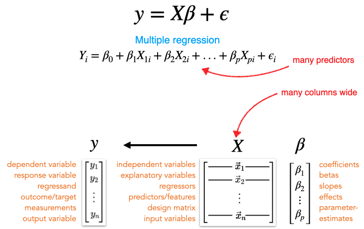
</div>

```{python}
compact = model('sales ~ tv', ads).fit()
augmented = model('sales ~ tv + radio', ads).fit()

compare(compact, augmented)
```

The large F-statistic and PRE tell us: **yes, adding radio is worth it!**

The PRE (Proportional Reduction in Error) tells us how much additional variance radio explains beyond TV alone.

Now let's evaluate *how* well our augmented model is doing overall.

## Model Diagnostics

Before interpreting our parameter estimates, we should check whether the model's **assumptions** are reasonable. Recall the key assumptions:

- **Independence**: Errors are independent of each other
- **Normality**: Errors are approximately normally distributed
- **Homoscedasticity**: Error variance is constant across predictions

`bossanova` provides a built-in 4-panel diagnostic plot via `.plot_resid()`:

```{python}
augmented.plot_resid()
```

How to read these panels:

- **Residuals vs Fitted** (top-left): Look for patterns. If there's a clear curve or fan shape, the model might be missing something (like a non-linear relationship or interaction).
- **Q-Q Plot** (top-right): Points should follow the diagonal line. Deviations in the tails indicate non-normality.
- **Scale-Location** (bottom-left): The spread of residuals should be roughly constant across fitted values. A funnel shape indicates heteroscedasticity.
- **Residuals vs Leverage** (bottom-right): Identifies influential observations that disproportionately affect the regression.

We can also inspect our model's overall fit by plotting predicted vs. observed values and checking the `.diagnostics` table:

```{python}
_grid = sns.relplot(
    data=augmented.data,
    x='sales', y='fitted',
    kind='scatter',
    height=5, aspect=1.5
)
_grid.set_axis_labels('Sales (observed)', 'Sales (predicted)')
_grid.set(title=f"Model R² = {augmented.diagnostics['rsquared'].item():.4f}")
```

```{python}
augmented.diagnostics
```

Our $R^2$ of ~0.90 tells us the model accounts for about 90% of the variance in sales. That's strong. The residual diagnostics look reasonable — some slight non-normality in the tails, but nothing too concerning for now.

## Parameter Inference `.infer()`

Now let's move from *model-level* evaluation (does adding radio help?) to *parameter-level* inference (how certain are we in each estimate?).

After fitting, `.params` shows us the bare estimates:

```{python}
augmented.params
```

These tell us *what* the model estimated, but not *how certain* we should be. When we call `.infer()` (which we already did when creating this model), `bossanova` computes standard errors, confidence intervals, t-statistics, and p-values.

```{python}
augmented.infer().params
```

Let's break down what each column means:

| Column | Meaning |
|--------|---------|
| **estimate** | Our best guess for $\hat{\beta}$ — the estimated slope or intercept |
| **se** | Standard error — how much $\hat{\beta}$ would vary across different samples |
| **ci_lower** | Lower range of the 95% confidence interval based on $SE$ |
| **ci_upper** | Upper range of the 95% confidence interval based on $SE$ |
| **statistic** | Signal-to-noise ratio: $t = \hat{\beta} / SE$ |
| **df** | degrees-of-freedom (how many data points are free to vary based on what we estimated) |
| **p_value** | p-value — assuming no true effect, how surprising is this *t*? |

We can also *method-chain* `.summary()` to get an R-style summary:

```{python}
augmented.infer().summary()
```

Here's how we'd interpret the `radio` estimate in plain English:

*For a given amount of TV advertising, an additional $1,000 spending on radio is associated with approximately 188 additional units in sales.*

> The $1,000 and 188 units come from the *measurement scale* of our variables — they're in units of "$1000 of spending" so we shift by 3 decimal places to make it concrete.

### What Standard Error Actually Means

<div align="center">
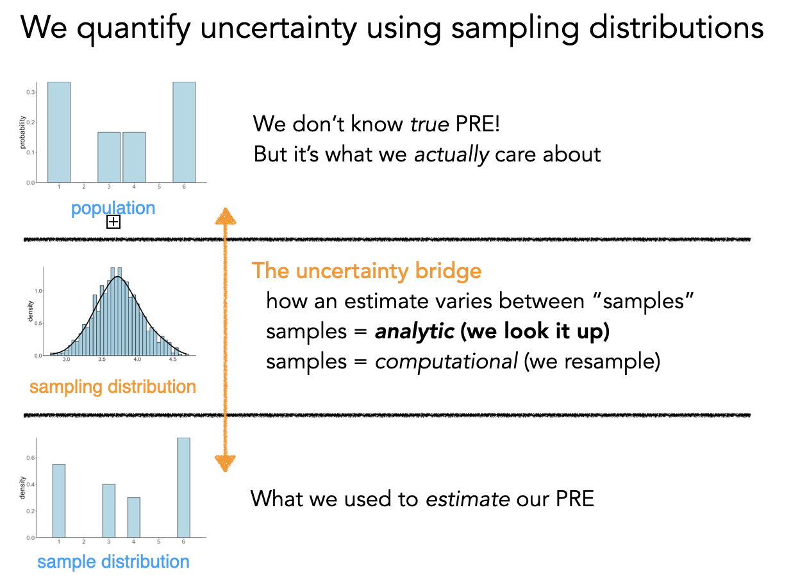
</div>

Remember: we're trying to learn about a **population** from a single **sample**. Our estimates $\hat{\beta}$ will change every time we collect a new sample. The standard error tells us *how much* we'd expect them to change — it's the **expected average deviation** from the true population value.

The formula for $SE_{\hat{\beta}}$ captures a fundamental trade-off:

<div align="center">
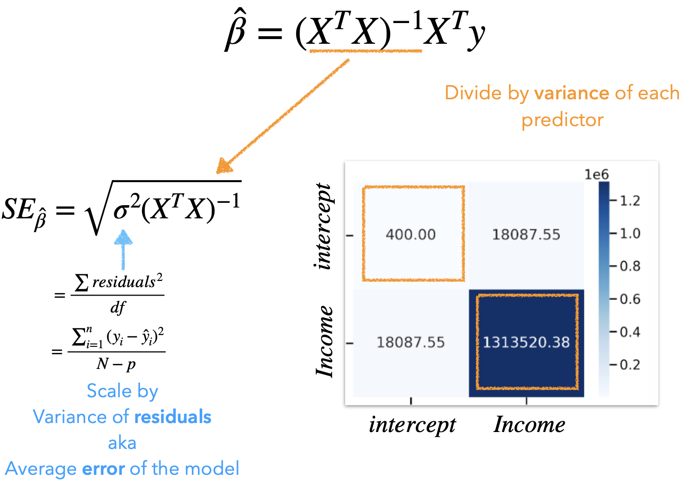
</div>

$$
SE_{\hat{\beta}} = \sqrt{\sigma^2 (X^T X)^{-1}}
$$

Where $\sigma^2$ is the average model error (MSE). The key insight is that our precision is approximately:

$$
SE \approx \frac{var(errors)}{\sqrt{DF_{error}}}
$$

This tells us:

- **More data** → more degrees of freedom → **better precision** (smaller SE)
- **More parameters** → fewer degrees of freedom → **worse precision** (larger SE)
- **More model error** → **worse precision** (larger SE)

```{python}
# Linear algebra library
import numpy as np

# Design matrix
X = augmented.designmat.to_numpy()

# Average model error - squared
sigma_squared = augmented.diagnostics.select('sigma').to_numpy() ** 2

# Square-root of the diagonal elements
np.sqrt(
    np.diagonal(
        # Average error * matrix "undo"
        sigma_squared * np.linalg.inv(X.T @ X)
    )
)
```

```{python}
# Standard errors
augmented.params.select('se')
```

This is the connection to model comparison: the reason we compare models with an accuracy-simplicity trade-off is *because* more parameters consume degrees of freedom, making each estimate *less precise*.

<div align="center">
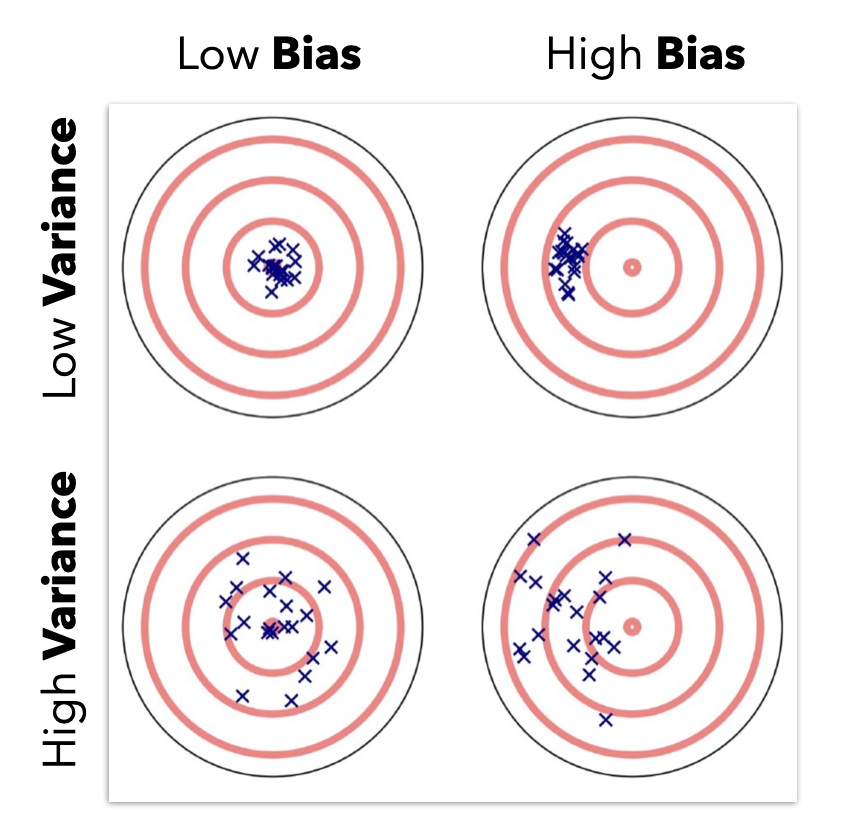
</div>

### The t-statistic: Signal-to-Noise

The *t*-statistic is the ratio of our estimate to its uncertainty:

$$
t = \frac{\hat{\beta}}{SE_{\hat{\beta}}} = \frac{\text{signal}}{\text{noise}}
$$

```{python}
# Manually divide columns
augmented.params.select('estimate') / augmented.params.select('se')
```

```{python}
# T-stat
augmented.params.select('statistic')
```

The larger the $|t|$, the more confidence we have in the **precision** of $\hat{\beta}$.

### The p-value: "How surprised should I be?"

The p-value asks: **assuming no true signal exists** ($\beta = 0$), how likely am I to observe a signal-to-noise ratio as extreme as this $t$?

If we assume this ratio follows a *t-distribution* (which has fatter tails than a normal distribution, especially at smaller sample sizes), we can "look up" the p-value:

- Small p-value → our observed $t$ would be very surprising under the null → evidence *against* $\beta = 0$
- Large p-value → our observed $t$ is unsurprising under the null → no strong evidence against $\beta = 0$

### Confidence intervals: "What's plausible?"

A 95% CI tells us: if we repeated this study many times, 95% of the resulting intervals would contain the true $\beta$. It gives a range of *plausible* values, which is often more informative than a single p-value.

### Parametric Inference Summary

The process `.infer()` performs by default (called "asymptotic" or "parametric" inference):

1. Estimate $\hat{\beta}$ from the data
2. Estimate uncertainty $SE_{\hat{\beta}}$ using the analytic formula
3. Compute signal-to-noise: $t = \hat{\beta} / SE_{\hat{\beta}}$
4. Look up the p-value: assuming $\beta = 0$, what's the probability of observing $|t|$ this large?

This works well when:

- You have enough data
- Model assumptions are reasonably met (check your diagnostics!)

If assumptions are violated, the assumed t-distribution may not be correct, and the p-values become unreliable. That's where non-parametric alternatives come in (we'll get to those later).

## Multicollinearity — The Other Assumption

<div align="center">
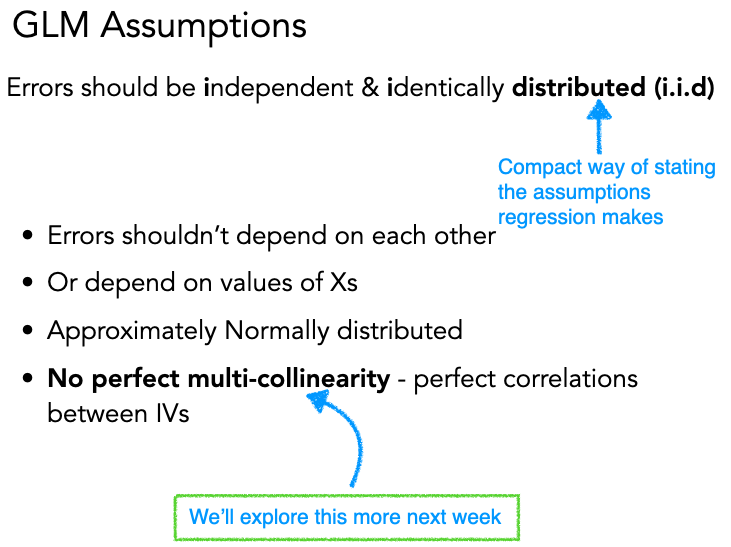
</div>

Previously we checked assumptions about the **errors** (iid: independent, identically distributed). Now let's talk about an assumption about the **predictors**: that they aren't too correlated with each other.

**Multicollinearity** occurs when predictors in a GLM are highly correlated. In the worst case — perfect correlation — we literally *can't tell the difference* between how much each variable uniquely predicts $y$!

<div align="center">
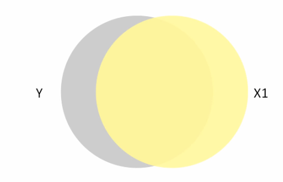
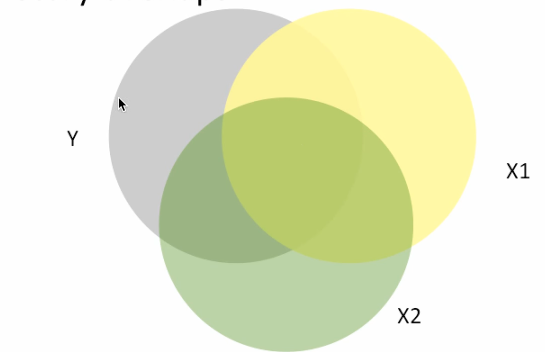
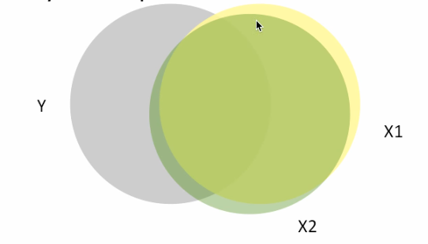
</div>

In these Venn diagrams, the overlap shows how much each predictor explains $y$. In the rightmost figure, $X_1$ and $X_2$ overlap so much that including both is nearly redundant.

### Visualizing the Problem

Here's what this looks like with 3D regression planes. With **uncorrelated** predictors, the regression plane is stable across samples:

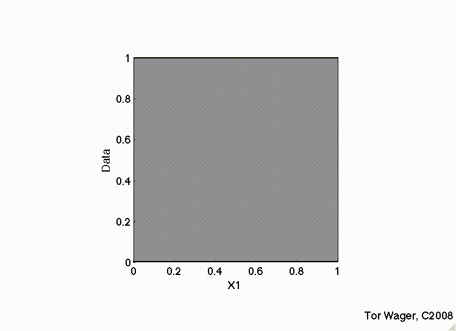

But with **correlated** predictors, the plane tips on a ridge and becomes unstable:

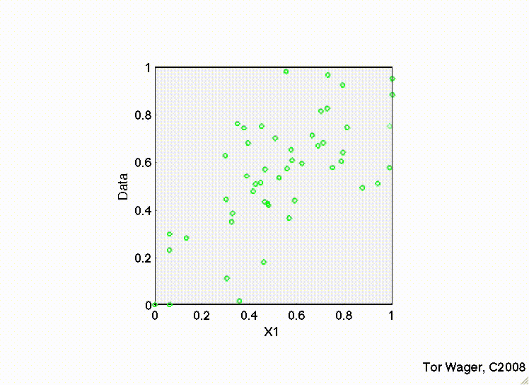

### Key Takeaways

Multicollinearity has specific, predictable effects:

- Parameter estimates can become **very large** and even **flip sign**
- Standard errors **always increase** → confidence intervals get **wider**
- Statistical **power decreases** — we're less certain of our estimates
- But overall model fit ($R^2$) **does not change** — the model predicts just as well, it just becomes *less interpretable*

You can see this in the figure below — as collinearity between predictors increases, the estimates become more variable and the confidence intervals balloon:

<div align="center">
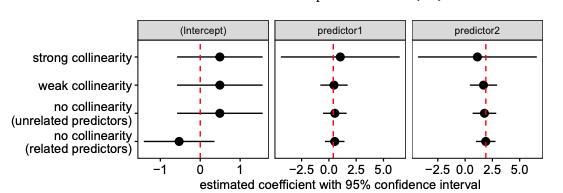
</div>

### Checking for Collinearity: VIF

The **Variance Inflation Factor (VIF)** generalizes the idea of pairwise correlations to tell us how much each predictor is correlated with *all other* predictors:

$$
\text{VIF}_k = \frac{1}{1 - R^2_{(-k)}}
$$

where $R^2_{(-k)}$ is the R-squared you'd get if you used predictor $X_k$ as the outcome and all other predictors as inputs. The square root of VIF tells you how much **wider** the confidence interval is compared to what you'd get with uncorrelated predictors.

**Rule of thumb**: VIF > 5 is a flag (it means CIs are 2.2x wider than they'd be with no collinearity). But this isn't a hard rule — it depends on your goals.

Always use a model's `.vif()` method to inspect this **before** you estimate parameters.

Let's see it in action with an **interaction** model, where collinearity is especially common.

```{python}
interaction_raw = model('sales ~ tv * radio', ads)
interaction_raw.plot_vif()
```

```{python}
interaction_centered = model('sales ~ center(tv) * center(radio)', ads)
interaction_centered.plot_vif()
```

Look at the difference! Without centering, the interaction term `tv:radio` has a VIF near 7 — meaning its CI is ~2.6x wider than it needs to be. With centering, all VIFs drop to near 1.

**Why?** The product of two uncentered variables ($tv \times radio$) is naturally correlated with each variable individually — if either goes up, the product goes up. Centering removes this **artificial correlation.**

### How Parameters Change

Centering doesn't change the overall fit — $R^2$ and predictions are identical. But notice how the *individual parameter estimates* differ:

```{python}
interaction_raw.fit().params
```

```{python}
interaction_centered.fit().params
```

Notice:

- The **interaction** estimate (`tv:radio` / `center(tv):center(radio)`) is the same — centering doesn't change the interaction slope
- The **main effect** estimates differ — because centering changes what "the effect of tv when radio = 0" means (now it's "...when radio = its mean")
- The **standard errors** are much smaller in the centered model — that's the VIF reduction at work

> **Key insight**: Centering is purely a *reparameterization*. The model is the same, but the *interpretation* and *precision* of individual parameters changes.

### Handling Multicollinearity

Common remedies:

- **Center** or **z-score** predictors before creating interactions (most common fix)
- **Remove** a redundant predictor
- Use **regularization** (Ridge or Lasso regression — beyond this course)

If the collinearity is *structural* (e.g., height in cm and height in inches), just drop one.
If it's from **interactions**, centering or z-scoring usually fixes it.

### Challenge: Z-scoring

In the centering example above, we used `center()` in the formula. `bossanova` also supports `zscore()`, which both centers *and* scales by the standard deviation.

1. Fit a new interaction model using `zscore(tv) * zscore(radio)` in the formula
2. Inspect the `.vif()` — how does it compare to the centered model?
3. Compare the parameter estimates with the centered model — what changed and why?
4. **Hint**: Z-scoring puts all predictors on the same scale (standard deviations), so the *magnitudes* of the estimates become directly comparable. How would you interpret the estimates in natural language?

```{python}
# Your code here
```

```{python}
# Your code here
```

## Non-Parametric Inference

Parametric inference relies on *assuming* the shape of the sampling distribution (a t-distribution). But what if we're not confident our assumptions hold?

We have two resampling-based alternatives:

1. **Bootstrapping** — estimate uncertainty by resampling *with replacement*
2. **Permutation** — estimate p-values by *shuffling* the data

### Bootstrap: Building the Sampling Distribution

<div align="center">
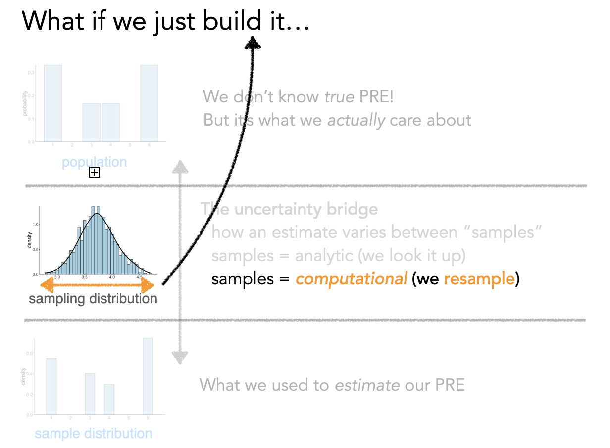
</div>

The idea: if we want to know how much $\hat{\beta}$ would change across different samples, we can *simulate* different samples by resampling from our data with replacement.

Conceptually, this is what's happening behind the scenes:

```python
# PSEUDO-CODE — what bootstrapping looks like conceptually
boot_estimates = []

for i in range(1000):
    # Create a "new" dataset by resampling rows with replacement
    new_data = ads.sample(fraction=1.0, with_replacement=True)

    # Fit the same model to this resampled data
    boot_model = model('sales ~ tv + radio', new_data).fit()

    # Save the parameter estimates
    boot_estimates.append(boot_model.params)

# The spread of boot_estimates IS the sampling distribution
# Its standard deviation IS the standard error
```

But `bossanova` makes this super easy for you using the `how` argument to `.infer()`. It offers the following options:

- `.infer(how='asymp')`: default asymptotic assumption
- `.infer(how='boot')`: bootstrap (resampling with replacement)
- `infer(how='perm')`: permutation (shuffling)

Let's look at how bootstrapping affects the `se` and `ci` columns compared to the default approach:

```{python}
# Default, you don't need to explicitly say how='asymp'
interaction_centered.infer(how='asymp').params
```

```{python}
# Bootstrap with 1k resamples by default
interaction_centered.infer(how='boot', seed=0)
interaction_centered.params
```

Compare the bootstrap SEs to the parametric SEs — bootstrap SEs tend to be *slightly larger* and CIs *slightly wider*, because we're making fewer distributional assumptions.

We can visualize the bootstrap distributions with `.plot_resamples()`:

```{python}
interaction_centered.plot_resamples()
```

Each histogram shows how $\hat{\beta}$ varied across 1000 bootstrap resamples. The *width* of each distribution IS the standard error, and the 2.5th/97.5th percentiles give us the confidence interval.

### Permutation: Building the Null Distribution

<div align="center">
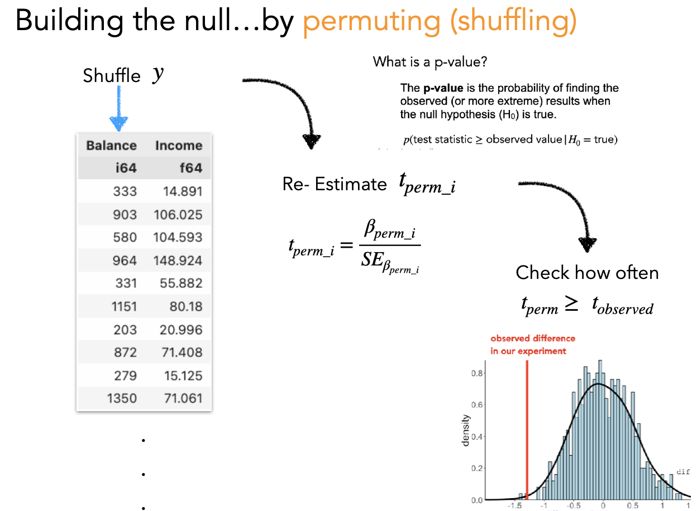
</div>

While bootstrapping answers *"how uncertain are our estimates?"*, permutation answers *"what would we expect under the null hypothesis?"*

The idea: **shuffle** the response variable ($y$) to break its relationship with the predictors, then refit the model. Do this many times to build up a distribution of t-statistics you'd expect *if there were no true relationship*.

```python
# PSEUDO-CODE — what permutation looks like conceptually
perm_tstats = []

for i in range(1000):
    # Shuffle ONLY the response variable — break the y ~ X relationship
    shuffled_data = ads.with_columns(
        ads['sales'].sample(fraction=1.0, shuffle=True).alias('sales')
    )

    # Fit the same model to shuffled data
    perm_model = model('sales ~ tv + radio', shuffled_data).fit().infer()

    # Save the t-statistics
    perm_tstats.append(perm_model.params['statistic'])

# The p-value = proportion of permuted |t| >= observed |t|
```

Again, `bossanova` handles this with `.infer("perm")`:

In this case lets look at how the default `p_value` column changes compared to permutation testing:

```{python}
interaction_centered.infer(how='asymp').params.select('term', 'estimate', 'p_value')
```

```{python}
# Permute with 1k resamples by default
interaction_centered.infer(how='perm', seed=0, ).params.select('term', 'estimate', 'p_value')
```

Notice that the *smallest* possible p-value is determined by the number of permutation tests we run. In this case because the estimates are very reliable the observed statistics are more extreme than *all* permuted samples (1000), reflect in the following formula:

$$\frac{1}{1000} = 0.001$$

In practice for stability we add 1 to both the denominator and numerator to avoid division errors:

$$\frac{2}{1001} = 0.000999$$

### Statistical Significance $\neq$ Practical Significance

Regardless of which inference method you use, it's critical to understand:

> **Statistical significance is about signal detection, not importance.**

The standard error (and hence *t* and *p*) depends on:

- The size of $\hat{\beta}$
- How bad the model is overall
- The sample size
- The variance of the predictor
- The correlation of that predictor with others

As your sample size grows, *every* non-zero effect becomes "statistically significant" — but how much data you collected has nothing to do with whether the effect *matters* in the real world.

From [The Truth About Linear Regression](https://stat-intuitions.com/_downloads/f310e3f537dfd55cd52f36eb33e96313/TALR_23.pdf):

> *The most important variables are not those with the largest-magnitude t statistics or smallest p-values. Statistical significance is always about what "signals" can be picked out clearly from background noise.*

**Bottom line**: Always pair statistical inference with practical interpretation. A "significant" coefficient of 0.001 might be meaningless in your domain, while a "non-significant" coefficient of 5.0 might be practically important but estimated with too much noise.

## Challenge: Is Newspaper Worth It?

Now we want to know whether spending on **newspaper** ads is a worthwhile *addition* to our model that already includes **TV** and **radio**.

1. Use `sns.lmplot` or `sns.heatmap` to visualize the relationships between `newspaper` and the other variables (`sales`, `tv`, `radio`)
2. Fit the three-predictor model: $sales \sim tv + radio + newspaper$
3. Use `compare()` to test whether adding newspaper is **worth it**
4. Then run a model with interactions $sales \sim tv * radio * newspaper$ and see if the interaction terms are worth it (think about centering/z-scoring)
5. Call `.infer().summary()` on the best fitting model
6. Does anything change if you use bootstrapping or permutation testing?
7. Write a natural language interpretation of the results as if you were writing them up in a Results section

```{python}
# Your code here
```

```{python}
# Your code here
```

```{python}
# Your code here
```

*Your results write-up here...*


