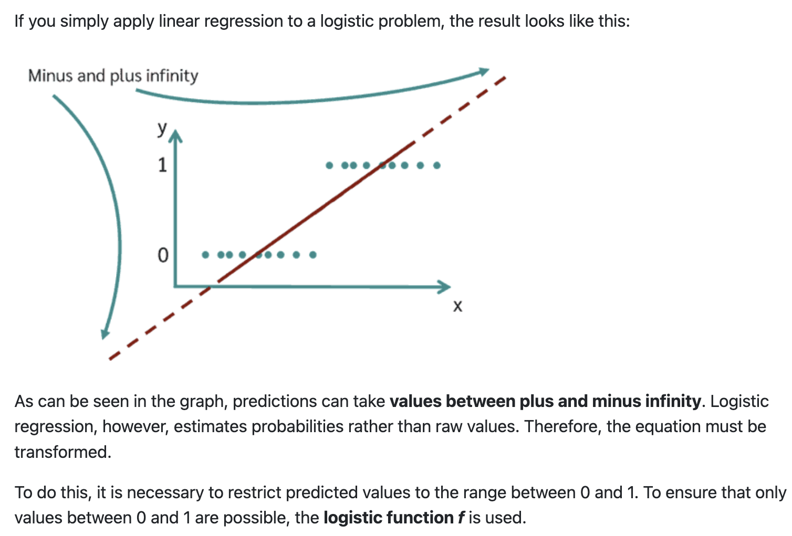
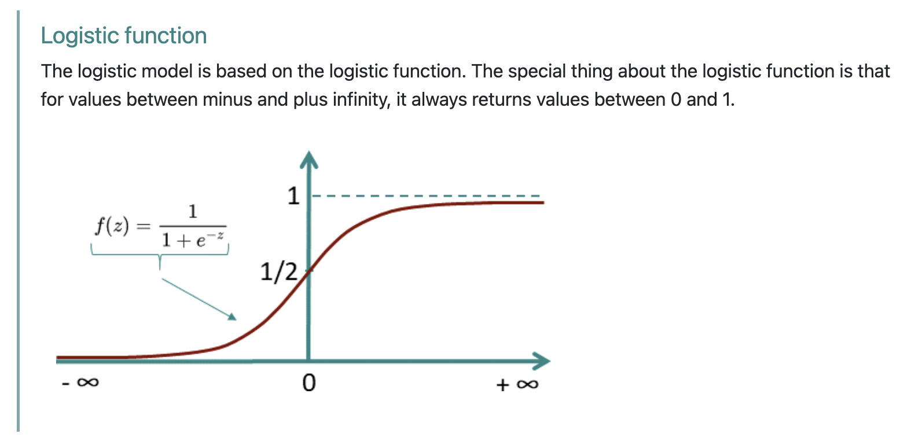
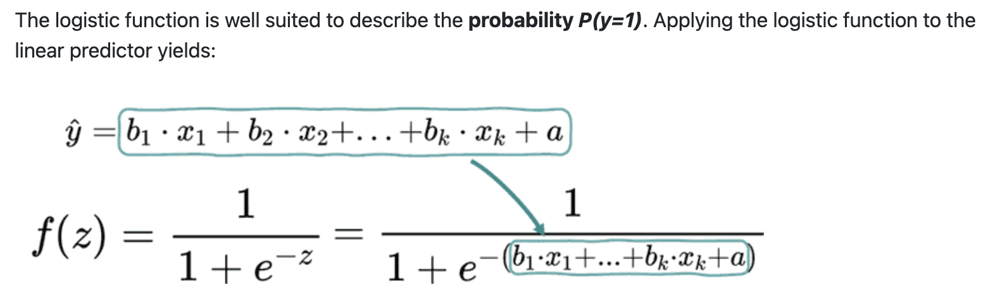
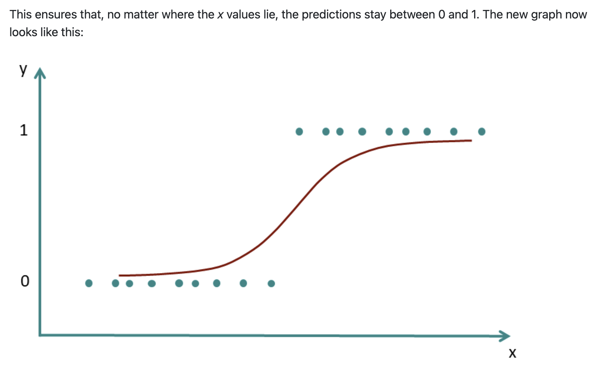

In the previous notebooks we built a full toolkit for working with the GLM:

- **Parameter Inference** (week 8): SE, *t*-stats, confidence intervals — *"How certain are we in $\hat{\beta}$?"*
- **Marginal Effects** (previous notebook): `.explore()` and the mixing board — *"What does the model predict when we wiggle a slider or flip a switch?"*

Throughout, our outcome variable has always been **continuous** (Balance, body mass, sales). The models we fit were all standard **OLS regression** — the default `family="gaussian"` in bossanova.

But the "G" in **G**LM stands for *Generalized*. Today we take the next step: what happens when our outcome is **binary** — yes/no, 0/1, true/false?

By the end of this notebook you'll know how to:

- Recognize why OLS fails for binary outcomes
- Fit a **logistic regression** using `family="binomial"`
- Interpret coefficients on the **log-odds** scale (and convert to odds ratios)
- Use `.explore()` to get predictions on the **probability** scale
- Distinguish two types of marginal effect: **AME** (Average Marginal Effect) vs **MEM** (Marginal Effect at the Mean)
- Understand when and why AME $\neq$ MEM — and what that means for your conclusions


```{python}
import polars as pl
from polars import col
import seaborn as sns
import numpy as np
import matplotlib.pyplot as plt

from bossanova import model, compare, load_dataset
```

## A New Dataset: Titanic Disaster

We've spent a lot of time predicting a **continuous** outcome (Balance in the previous notebooks). Now let's see how we can use the GLM to model a **categorical** (binary) outcome

> **Can we predict whether someone Survived the titanic crash from their Age and Sex?**

`survived` is a **binary** variable — it's either 1 (Yes) or 0 (No). This is a fundamentally different kind of outcome than what we've modeled before.

Let's start by visualizing the data:

```{python}
titanic = load_dataset("titanic").drop_nulls().drop_nans()
titanic
```

We'll use `seaborn` to plot the outcome on the y-axis against passenger age on the x-axis:

```{python}
sns.lmplot(
    data=titanic.to_pandas(),
    x="age",
    y="survived",
    height=5,
    aspect=1.3,
    ci=False,
    fit_reg=False,
).set(ylabel="Survived?\n(No=0 Yes=1)", xlabel="Passenger Age")
```

Let's break this out by `sex` as well:

```{python}
sns.lmplot(
    data=titanic.to_pandas(),
    x="age",
    y="survived",
    hue="sex",
    col="sex",
    height=5,
    aspect=1.3,
    ci=False,
    fit_reg=False,
).set(ylabel="Survived?\n(No=0 Yes=1)", xlabel="Passenger Age")
```

## GLM for Binary Data

Let's see what happens if we naively fit a standard OLS regression predicting this 0/1 outcome.
Before we use `bossanova` we can visualize this with `seaborn` by setting `fit_reg=True` and `ci="95"`

```{python}
sns.lmplot(
    data=titanic.to_pandas(),
    x="age",
    y="survived",
    hue="sex",
    col="sex",
    height=5,
    aspect=1.3,
    fit_reg=True,
    truncate=False,
).set(ylabel="Survived?\n(No=0 Yes=1)", xlabel="Passenger Age")
```

The first issue is that a standard OLS model makes predictions **beyond the scale of the data**!
Survival is either 0 or 1, but the regression line goes beyond 1 and below 0



To handle this we want to **constrain** the output of the model between 0-1, without overcomplicating all the other nice properties of the GLM. To do this we can use a **link function**:

This squashes any real number into the (0, 1) range. For binary outcomes, we use the **logistic** (also called **sigmoid**) function:

$$
P(y = 1) = \frac{1}{1 + e^{-(X\hat{\beta})}}
$$

This S-shaped curve is flat near 0 and 1 (the "floor" and "ceiling") and steep in the middle. Let's visualize it:



The **link function** takes the linear model we're used to working with and **non-linearly transforms it** before outputting $\hat{y}$ predictions:



If we use this link function then we can ensure our model predictions can be interpreted as **probabilities** between 0-1:



Notice two critical features of this curve:

1. **Bounded**: No matter what $X\hat{\beta}$ is, the output is always between 0 and 1
2. **Nonlinear**: The slope is *steepest in the middle* and *flattest at the extremes*

That second point is going to matter a lot when we get to marginal effects. But first, let's fit the model.

Let's see this when applied to the titanic data visually. In seaborn we can just use the `logistic=True` argument to the same plotting function as before:

```{python}
sns.lmplot(
    data=titanic.to_pandas(),
    x="age",
    y="survived",
    hue="sex",
    col="sex",
    height=5,
    aspect=1.3,
    fit_reg=True,
    truncate=False,
    logistic=True,
).set(ylabel="Survived?\n(No=0 Yes=1)", xlabel="Passenger Age")
```

Notice how the regression line is now *curved*, and specifically it's the **logistic function** that we're curving.

## General(ized) Linear Model (GLM)

This general approach of using *link functions* to transform the model predictions is what we call the [**Generalized Linear Model**](https://en.wikipedia.org/wiki/Generalized_linear_model) not to be confused with the [General Linear Model (GLM)](https://en.wikipedia.org/wiki/General_linear_model):

GLM (General Linear Model): general approach of $y= X \beta$

Generalized Linear Model: extension of the GLM where we model:

$E(Y|X) = f^{-1}(X\beta)$

Where $E(Y|X)$ is the *expected value* of $y$, e.g. it's *mean*
And $f()$ is our **link function**, e.g. *logistic*

### Common tests *are* flavors of GLM

**This is the "magic"** that allows us to estimate a large number of models using the same general framework and everything we've learned so far! As long as we can specify a *link function* we're able to model outcomes that are not continuous or make other **non-normal** distributional assumptions.

We'll add this as a link to the website, but you can now appreciate how: [**common statistical tests are just linear models**](https://sciminds.ucsd.edu/bossanova/linear-models/)

The rest of this notebook explores *logistic* regression, but the other common link function worth knowing about is the: *log-link* function which we use in **poisson regression:**

$Y_i \sim \text{Poisson}(\mu_i), \quad \ln(\mu_i) = \mathbf{X}_i \boldsymbol{\beta}$

$\ln(\mu_i) = \beta_0 + \beta_1 x_{1i} + \cdots + \beta_k x_{ki}$

$\mu_i = e^{\beta_0 + \beta_1 x_{1i} + \cdots + \beta_k x_{ki}}$

You might know it more commonly as [chi-square goodness-of-fit](https://sciminds.ucsd.edu/bossanova/linear-models/count-data/) or [chi-square test-of-independence](https://sciminds.ucsd.edu/bossanova/linear-models/count-data/). While the exact details are beyond the scope of what we're able to cover, try to understand the *general ideas* and refer to the linked guides if you need these approaches for your final project or future research!

## Estimating Models

Now let's using `bossanova` to estimate and compare a regular OLS regression model and a *logistic* regression model. Everything is exactly the same, but we'll add the `family='binomial'` for the logistic model:

```{python}
# Regular OLS regression predicting survival
m_ols = model("survived ~ age*sex", titanic).fit()
m_ols.params
```

### Interpreting log-odds coefficients

These coefficients are on the **log-odds** scale — *not* the probability scale. This is the natural scale of logistic regression:

$$
\log\left(\frac{P(\text{Survived} = 1)}{1 - P(\text{Survived} = 1)}\right) = \beta_0 + \beta_1 \cdot Age + \beta_2 \cdot Sex + \beta_3 \cdot Age \times Sex
$$

```{python}
# Logistic regression predicting survival
m_log = model("survived ~ age*sex", titanic, family="binomial").fit()
m_log.params
```

Odds ratios are *slightly* more interpretable: a value of 1.0 means "no effect," above 1 means "increases the odds," below 1 means "decreases the odds."

But honestly? Neither log-odds nor odds ratios map easily onto the question we actually care about: **"By how many percentage points does the probability of being a student change?"**

This is where marginal effects come back.

```{python}
m_log.to_odds_ratio()
```

What do log-odds mean? Let's build the chain:

Our model predicts survival from `age * sex` (with female as the reference group). Each coefficient is a **log-odds** value. We can convert to **odds** by exponentiating, and to **probabilities** by plugging in specific values.

**Log-odds (raw coefficients)**

| Term | $b$ | Interpretation |
|------|-----|----------------|
| Intercept | 1.744 | Log-odds of survival for a **female at age 0** |
| age | 0.029 | For **females**, each +1 year of age adds 0.029 to log-odds (nearly flat) |
| sex[male] | −0.421 | At age 0, being male shifts log-odds down by 0.421 vs female |
| age:sex[male] | −0.071 | The age slope is **0.071 more negative** for males than females |

**Odds (exponentiate: $e^b$)**

| Term | $e^b$ | Interpretation |
|------|-------|----------------|
| Intercept | 5.72 | A female at age 0 has ~5.7:1 odds of survival |
| age | 1.03 | For females, each year multiplies odds by 1.03 ($\approx$ no change) |
| sex[male] | 0.66 | At age 0, males have 66% the odds of females |
| age:sex[male] | 0.93 | Each year of age shrinks males' odds ratio by an additional factor of 0.93 |

**Probability (concrete examples)**

Since the logistic function is nonlinear, individual coefficients don't map cleanly to probabilities. But we can plug in specific values using:

$$P(\text{survival}) = \frac{1}{1 + e^{-(\beta_0 + \beta_1 \text{age} + \beta_2 \text{male} + \beta_3 \text{age} \cdot \text{male})}}$$

| Person | Log-odds | Probability |
|--------|----------|-------------|
| Female, age 30 | $1.744 + 0.029(30) = 2.61$ | **93%** |
| Male, age 30 | $1.744 + 0.029(30) - 0.421 - 0.071(30) = 0.07$ | **52%** |
| Female, age 60 | $1.744 + 0.029(60) = 3.47$ | **97%** |
| Male, age 60 | $1.744 + 0.029(60) - 0.421 - 0.071(60) = -1.20$ | **23%** |

**The key story:** Age barely matters for females (slope $\approx 0.03$), but **hurts males substantially** (slope $\approx 0.03 - 0.07 = -0.04$).

That interaction means older men had much worse survival odds — consistent with "women and children first.

## Marginal Effects to the Rescue

Remember from the previous notebook: marginal effects let us **ask the model what it predicts** instead of puzzling over raw parameters. This was useful for OLS — it's *essential* for logistic regression.

Let's use `.explore()` to get predictions on the **probability** scale. By default we get predictions on the log-odds scale:

```{python}
# Default: log-odds scale (hard to interpret)
m_log.explore("sex@[female] ~ age@[30]", effect_scale="link")
```

But if we pass `effect_scale="response"` we can transform from log-odds to probabilities:

```{python}
# Probability scale (what we actually want!)
m_log.explore("sex@[female] ~ age@[30]", effect_scale="response")
```

Notice this matches our hand calculation above! 30 year old femaled had about 93% survival probability!

First the *change* in probability for age:

```{python}
# Change in probability scale (what we actually want!)
m_log.explore("age", effect_scale="response")
```

We can plot this marginal estimate using `.plot_explore()`

```{python}
m_log.plot_explore("age", effect_scale="response")
```

But it's often more helpful to see the full set of *predictions* from the model using `.plot_predict()`

```{python}
m_log.plot_predict('age')
```

We can interpret this as a *average change in survival probability* as age increases by 1 year, much easier -- No log-odds, no exponentiation — just probabilities.

Let's do the same for sex:

```{python}
m_log.explore("sex", effect_scale="response")
```

Since we're dealing with *switches* these simply the average survival probabilities for each sex!

### Unpacking the interaction

We have an `age * sex` interaction. The mixing board lets us see how the effect of one predictor varies across levels of the other:

```{python}
m_log.explore("sex ~ age@[5, 10, 20, 40, 80]", effect_scale="response")
```

`bossanova` with automatically handle computing **Average Marginal Effects** (AME) when working with generalized linear models, which gives us the interpretation we want: how *average predicted probabilities* change based on our mixing-board settings

Notice how if we explore the OLS regression model instead, we get a "predicted probability" > 1 for 80 year-old female passengers:

```{python}
# How does the Income effect vary at different Rating levels?
m_ols.explore("sex ~ age@[5, 10, 20, 40, 80]", effect_scale="response")
```

Let's look at the interaction visually

```{python}
m_log.plot_explore("age ~ sex", effect_scale="response")
```

Once again the actual predictions can be more helpful!

```{python}
m_log.plot_predict("age ~ sex")
```

## AME vs MEM — When They Diverge

In the lecture slides we introduced two ways to summarize a marginal effect:

### MEM: Marginal Effect at the Mean

$$
MEM = \frac{\partial \hat{y}}{\partial x} \text{ evaluated at } \bar{x}_1, \bar{x}_2, \ldots
$$

Set all sliders to their **mean position**, then nudge one slider and see what happens. It's the effect for a single "hypothetical average person."

**Mixing board intuition**: Set every slider to its average position, nudge one slider, and record the change.

### AME: Average Marginal Effect

$$
AME = \frac{1}{N} \sum_{i=1}^{N} \frac{\partial \hat{y}}{\partial x_i}
$$

Compute the effect for **each person individually** (keeping their own covariate values), then **average** across people.

**Mixing board intuition**: Imagine a separate copy of the mixing board for each person in your dataset, each with their own slider settings. Nudge the same slider on every copy, record the change for each, then average.

### When does this matter?

In **OLS** (linear regression), AME = MEM. Always. Because the sigmoid curve *is* a straight line — the slope is the same everywhere, so it doesn't matter whether you evaluate it at the mean or average across individuals.

In **logistic regression**, AME $\neq$ MEM. Because the sigmoid curve has a changing slope — steep in the middle, flat at the edges. The MEM evaluates the slope at one point (the mean). The AME averages slopes across all the different points where real people sit on the curve.

Let's see this concretely.

```{python}
_fig, (_ax1, _ax2) = plt.subplots(1, 2, figsize=(12, 4.5))

_x = np.linspace(-6, 6, 300)
_sigmoid = 1 / (1 + np.exp(-_x))
_slope = _sigmoid * (1 - _sigmoid)  # derivative of sigmoid

# Left panel: sigmoid with tangent lines at different points
_ax1.plot(_x, _sigmoid, linewidth=2, color="steelblue")
for _pt, _col, _lbl in [(-3, "#e74c3c", "Flat (floor)"), (0, "#2ecc71", "Steep (middle)"), (3, "#9b59b6", "Flat (ceiling)")]:
    _y_pt = 1 / (1 + np.exp(-_pt))
    _slope_pt = _y_pt * (1 - _y_pt)
    _tangent_x = np.linspace(_pt - 1.5, _pt + 1.5, 50)
    _tangent_y = _y_pt + _slope_pt * (_tangent_x - _pt)
    _ax1.plot(_tangent_x, _tangent_y, color=_col, linewidth=2, linestyle="--")
    _ax1.scatter([_pt], [_y_pt], color=_col, s=80, zorder=5)
    _ax1.annotate(_lbl, (_pt, _y_pt), textcoords="offset points", xytext=(10, 10), fontsize=9, color=_col)
_ax1.set_xlabel(r"Linear predictor ($X\hat{\beta}$)")
_ax1.set_ylabel("Probability")
_ax1.set_title("Slope depends on location")
_ax1.set_ylim(-0.1, 1.1)

# Right panel: the slope itself
_ax2.plot(_x, _slope, linewidth=2, color="darkorange")
_ax2.set_xlabel(r"Linear predictor ($X\hat{\beta}$)")
_ax2.set_ylabel("Marginal effect (slope)")
_ax2.set_title("Marginal effect varies across the curve")
_ax2.axvline(0, color="gray", linestyle=":", alpha=0.5)

plt.tight_layout()
sns.despine()
_fig
```

The left panel shows the sigmoid with tangent lines at three points — the slope is steepest at the center and nearly flat at the extremes.

The right panel shows the marginal effect (slope) itself as a function of the linear predictor — it's a bell curve peaking at 0.25 when $X\hat{\beta} = 0$ (probability = 0.5).

So:

- **MEM** picks the slope at whatever the mean linear predictor is — a single point on the orange curve
- **AME** averages the slope across all the different points where your data actually sits

If your data is mostly in the middle of the curve, AME ≈ MEM. If your data is spread across the extremes, they'll diverge.

By default, `.explore()` on a logistic model uses `how="auto"`, which selects **AME** (averaging over the actual data). We can explicitly request each:

```{python}
# AME: Average Marginal Effect (default for GLMs)
m_log.explore("sex", effect_scale="response", how="ame")
```

```{python}
# MEM: Marginal Effect at the Mean (evaluate at mean covariate values)
m_log.explore("sex", effect_scale="response", how="mem")
```

Compare the two estimates above. They're **not the same!** In the OLS model they're identical!

```{python}
m_ols.explore("sex", how="ame")
```

```{python}
m_ols.explore("sex", how="mem")
```

The discrepancy arises because:

- The **MEM** evaluates the slope for a hypothetical person at the *mean* of all predictors — one point on the sigmoid
- The **AME** evaluates the slope for *each real person* at their own covariate values, then averages — a weighted average across many points on the sigmoid

> **Which one should you report?** It depends on your question:
>
> - **AME** answers: *"On average across the people in my sample, how much does a 1-unit increase in Income change the probability of being a student?"*
> - **MEM** answers: *"For a person at the mean of all covariates, how much does a 1-unit increase in Income change the probability?"*
>
> The AME is generally preferred because it reflects what happens to *real people*, not a hypothetical average person who may not exist in your data.

## The DataColada Insight

Now that we understand AME vs MEM, let's go deeper into a subtlety that trips up even experienced researchers.

The blog [DataColada #57](https://datacolada.org/57) ("Interactions in Logit Regressions: Why Positive May Mean Negative") makes a striking point:

> In logistic regression, a **positive** interaction coefficient can correspond to a **negative** marginal effect on the probability scale.

How is this possible? Because of two different kinds of "interaction":

- **Conceptual interaction**: the actual relationship between your variables — what you're trying to study
- **Mechanical interaction**: an artifact of the sigmoid's ceiling and floor — when probability is already near 0 or 1, *any* predictor's effect gets compressed regardless of the true relationship

The log-odds coefficient captures only the *conceptual* component. When you compute marginal effects (derivatives of the predicted probability), you're mixing in the *mechanical* component as well.

Let's look at the interaction between Income and Rating. First, what does the coefficient say?

```{python}
# The raw interaction coefficient (log-odds scale)
m_log.params
```

Now let's look at how the marginal effect of age *differs* between sexes over arange of ages:

```{python}
m_log.explore("sex[male-female] ~ age@[0, 10, 20, 30, 40, 50,60,70,80]", effect_scale="response")
```

In this example the difference in survival probabilities is always higher for females, but notice how it changes depending on what income level we look at. The coefficient in log-odds space tells one story; the marginal effect on the probability scale may tell a different one — especially at the extremes where the sigmoid is flat.

This is exactly the DataColada insight: **the nonlinearity of the link function creates "mechanical" interactions that can mask or even reverse the conceptual relationship.**

DataColada (following the statistician William Greene) recommends: **don't summarize an interaction with a single AME or MEM.** Instead, **explore marginal effects across the full range of predictor values** to see the whole picture.

## Your Turn

In the cell below we've created a new column that indicates student status as 0/1 called `student_bin`

Use it as an outcome variable to see what relationships you can find between other variables in the dataset

```{python}
credit = load_dataset("credit")
credit_bin = credit.with_columns(
    student_bin = pl.when(col("Student")=="Yes").then(pl.lit(1)).otherwise(pl.lit(0))
).select("student_bin", "Income", "Rating", "Limit", "Balance", "Age", "Education", "Ethnicity")

credit_bin.head()
```

```{python}
# Your code here
```

```{python}
# Your code here
```

```{python}
# Your code here
```

```{python}
# Your code here
```


