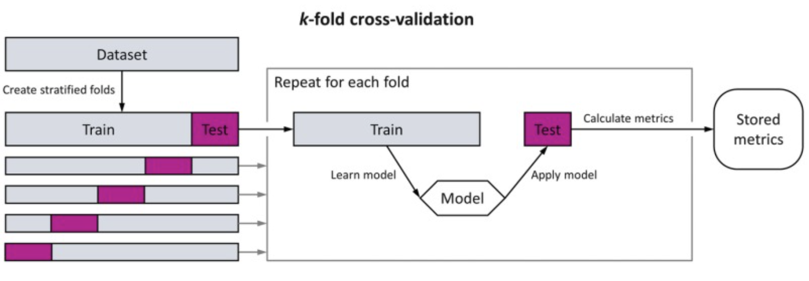
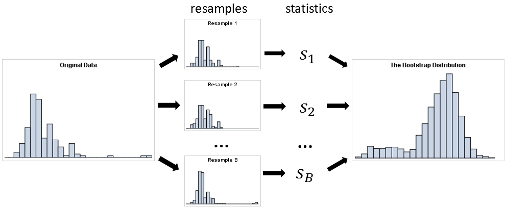
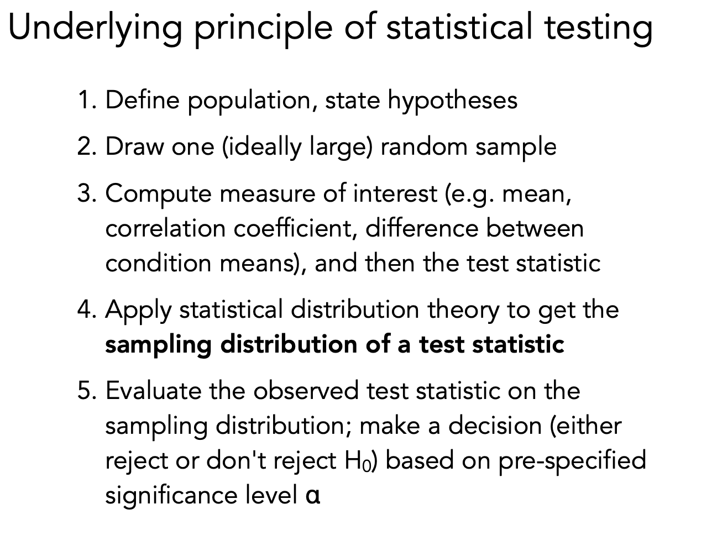
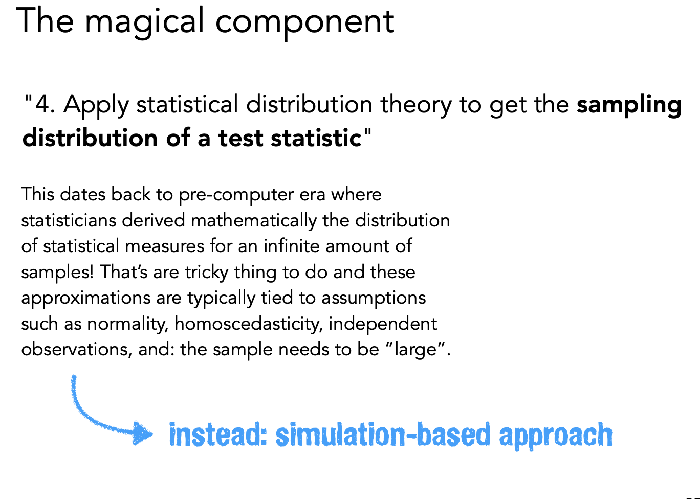
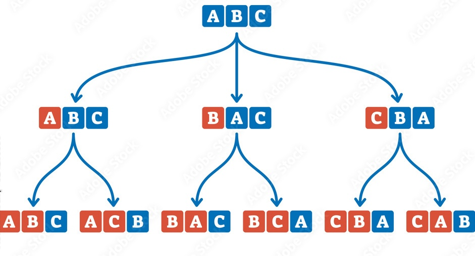

<!--
=============================================================================
PSYC 201B MARP TEMPLATE - Comprehensive Feature Showcase
=============================================================================

This template demonstrates ALL Marp features you can use for creating slides.
Use this as a reference when building your own presentations.

QUICK START:
  1. Copy this file and rename it for your lecture
  2. Delete the example slides you don't need
  3. Preview with: marp --preview your-file.md
  4. Export PDF: marp --pdf your-file.md
  5. Export PPTX: marp --pptx your-file.md

TABLE OF CONTENTS:
  1. Title Slides
  2. Section Dividers
  3. Content Slides (bullets, sub-bullets)
  4. Two-Column Layouts
  5. Math & Equations
  6. Code Blocks
  7. Tables
  8. Images & Figures
  9. Background Images
  10. Quotes & Callouts
  11. Discussion Prompts
  12. Special Classes (invert, small text, etc.)
  13. Pagination Control
  14. Presenter Notes
  15. Headers & Footers

=============================================================================
-->

<!-- =========================================================================
     SECTION 1: TITLE SLIDES
     ========================================================================= -->

<!-- _class: title -->
<!-- _paginate: skip -->

# Week 05: Model Comparison

**PSYC 201B** | Statistical Intuitions for Social Scientists

<div class="title-meta">

**Date:** February 3, 2026
**Instructor:** Eshin Jolly

</div>

<div class="title-footer">

https://stat-intuitions.com/

</div>

---

<!--
ALTERNATIVE TITLE SLIDE FORMAT
Use this for a simpler title without the course branding
-->

<!-- _class: title-simple -->
<!-- _paginate: skip -->

# Lecture Title Here

Subtitle or additional context

**Your Name**
Date

---

<!-- =========================================================================
     SECTION 2: SECTION DIVIDERS
     ========================================================================= -->

<!-- _class: section -->

# Section Divider

Use these to separate major topics

---

<!-- _class: section-alt -->

# Alternative Section Style

With a subtle background

---

<!-- =========================================================================
     SECTION 3: CONTENT SLIDES - BULLETS & TEXT
     ========================================================================= -->

## Regular Content Slide

This is a standard content slide with bullets.

- First main point with **bold emphasis**
- Second point explaining a concept
- Third point with elaboration
  - Sub-point using dash style
  - Another sub-point with *italic text*
  - Sub-points are slightly smaller and gray

---

## Numbered Lists

Use numbered lists for sequential steps or ordered content:

1. First step in the process
2. Second step builds on the first
3. Third step completes the sequence
   1. Nested numbering works too
   2. For sub-steps within a step

---

## Mixed Content

You can combine different elements:

- A bullet point introducing a concept

> A quote or important callout within the content

- Another bullet continuing the discussion
- Final point wrapping up

*Use italics for subtle emphasis or citations.*

---

<!-- =========================================================================
     SECTION 3b: FRAGMENTS & INCREMENTAL REVEALS
     (Only works in HTML preview, not PDF export)
     ========================================================================= -->

## Fragmented List (Star Syntax)

Build up points one at a time using `*` instead of `-`:

* First point appears immediately
* Second point on next click
* Third point on next click
* Final point reveals last

---

## Fragments with Pause Markers

You can also use pause comments for more control:

- This appears first

<!-- pause -->

- This appears second

<!-- pause -->

- This appears third

<!-- pause -->

**Conclusion:** Pause markers work with any content, not just lists.

---

## Fragmented Numbered List

* 1. Step one: Gather your data
* 2. Step two: Clean and preprocess
* 3. Step three: Fit the model
* 4. Step four: Evaluate results

---

## Mixed Fragments

Some content is always visible.

* But this bullet reveals on click
* And this one next

More visible content here.

<!-- pause -->

> This quote appears after a pause

<!-- pause -->

**Key takeaway:** revealed at the end.

---

<!-- _class: small -->

## Dense Content Slide

<!-- Use the 'small' class when you need to fit more content -->

When you have lots of content to cover:

- Point one about a complex topic that needs explanation
- Point two with additional context and detail
- Point three continuing the discussion
- Point four adding more information
- Point five wrapping up this section
- Point six because sometimes you need more
  - Sub-point a
  - Sub-point b
  - Sub-point c

This class reduces font sizes proportionally throughout.

---

<!-- =========================================================================
     SECTION 4: TWO-COLUMN LAYOUTS
     ========================================================================= -->

## Two-Column Comparison

<div class="columns">
<div>

<div class="label-explanation">Explanation</div>

- Focus on understanding **why**
- Causal mechanisms matter
- Interpretability is key
- Theory-driven approach

</div>
<div>

<div class="label-prediction">Prediction</div>

- Focus on predicting **what**
- Accuracy is the goal
- Black boxes acceptable
- Data-driven approach

</div>
</div>

---

## Two Columns with Images

<div class="columns">
<div>

### Left Column

Content on the left side.

- Point one
- Point two
- Point three

</div>
<div>

### Right Column

Content on the right side.

- Point A
- Point B
- Point C

</div>
</div>

---

## Two Columns: Text + Figure

<div class="columns">
<div>

### Key Findings

- Result one shows X
- Result two indicates Y
- Implications for theory

**Conclusion:** The data support our hypothesis.

</div>
<div class="figure-col">



<p class="caption">Figure 1: Cross-validation procedure</p>

</div>
</div>

---

## Three Column Layout

<div class="columns-3">
<div>

### Model A

- Simple
- Fast
- Interpretable

</div>
<div>

### Model B

- Moderate
- Balanced
- Flexible

</div>
<div>

### Model C

- Complex
- Powerful
- Black-box

</div>
</div>

---

<!-- =========================================================================
     SECTION 5: MATH & EQUATIONS
     ========================================================================= -->

## Inline Math

You can use inline math like $y = mx + b$ within your text.

The sample mean is denoted $\bar{x} = \frac{1}{n}\sum_{i=1}^{n} x_i$ and represents the average.

Greek letters work too: $\alpha$, $\beta$, $\gamma$, $\sigma^2$, $\mu$

---

## Block Equations

<div class="math-box">

$$\text{Data} = \text{Model} + \text{Error}$$

</div>

The general linear model:

$$Y_i = \beta_0 + \beta_1 X_{1i} + \beta_2 X_{2i} + \varepsilon_i$$

Where:
- <span class="cyan">$\beta_0$</span> is the intercept
- <span class="navy">$\beta_1, \beta_2$</span> are the slopes
- <span class="coral">$\varepsilon_i$</span> is the error term

---

## Multiple Equations

<div class="math-box">

$$
\begin{aligned}
\text{RSS} &= \sum_{i=1}^{n}(y_i - \hat{y}_i)^2 \\[0.5em]
R^2 &= 1 - \frac{\text{RSS}}{\text{TSS}} \\[0.5em]
\text{AIC} &= 2k - 2\ln(\hat{L})
\end{aligned}
$$

</div>

---

## Matrix Notation

For those linear algebra moments:

$$
\mathbf{Y} = \mathbf{X}\boldsymbol{\beta} + \boldsymbol{\varepsilon}
$$

$$
\hat{\boldsymbol{\beta}} = (\mathbf{X}^\top\mathbf{X})^{-1}\mathbf{X}^\top\mathbf{Y}
$$

---

<!-- =========================================================================
     SECTION 6: CODE BLOCKS
     ========================================================================= -->

## Python Code

```python
import numpy as np
import pandas as pd

# Generate sample data
np.random.seed(42)
sample = np.random.normal(loc=100, scale=15, size=30)

# Calculate statistics
print(f"Mean: {np.mean(sample):.2f}")
print(f"SD: {np.std(sample, ddof=1):.2f}")
```

---

## Code with Output

```python
# Fit a simple linear model
import statsmodels.api as sm

X = sm.add_constant(data['predictor'])
model = sm.OLS(data['outcome'], X).fit()
print(model.summary())
```

<div class="output">

```
                 coef    std err          t      P>|t|
const          2.4531      0.123     19.944      0.000
predictor      0.8721      0.045     19.380      0.000
```

</div>

---

## Inline Code

Use `np.mean()` to calculate the mean.

The function `pd.DataFrame.groupby()` is useful for aggregation.

File paths like `~/data/experiment.csv` should be quoted.

---

## Side-by-Side Code Comparison

<div class="columns">
<div>

**NumPy**
```python
# Vectorized operations
x = np.array([1, 2, 3])
y = x * 2 + 1
```

</div>
<div>

**Pandas**
```python
# DataFrame operations
df['new'] = df['old'] * 2 + 1
```

</div>
</div>

---

<!-- =========================================================================
     SECTION 7: TABLES
     ========================================================================= -->

## Simple Table

| Model | AIC | BIC | R² |
|-------|-----|-----|-----|
| Null | 245.3 | 248.1 | 0.00 |
| Simple | 198.7 | 204.2 | 0.45 |
| Full | 187.2 | 198.4 | 0.62 |

The full model shows the best fit.

---

## Comparison Table

| Feature | Model A | Model B | Model C |
|---------|:-------:|:-------:|:-------:|
| Interpretability | High | Medium | Low |
| Flexibility | Low | Medium | High |
| Computational Cost | Low | Medium | High |
| Recommended Use | Explanation | Balanced | Prediction |

---

## Styled Table

<div class="table-container">

| Variable | Mean (SD) | Range |
|----------|-----------|-------|
| Age | 32.4 (8.7) | 18-65 |
| Income ($K) | 58.2 (24.1) | 15-150 |
| Education (years) | 14.8 (2.3) | 8-20 |

</div>

<p class="muted">Table 1: Descriptive statistics for sample (N = 150)</p>

---

<!-- =========================================================================
     SECTION 8: IMAGES & FIGURES
     ========================================================================= -->

## Basic Image



<p class="caption">Figure 1: Bootstrap resampling illustration</p>

---

## Image Sizing Options

<!-- Width only -->


<!-- Height only -->


<!-- Both dimensions -->


---

## Centered Image


---

## Multiple Images in Row

<div class="image-row">


</div>

<p class="caption">Figure 2: (A) Distribution plot, (B) Scatter plot, (C) Bootstrap concept</p>

---

<!-- =========================================================================
     SECTION 9: BACKGROUND IMAGES
     ========================================================================= -->

<!-- _class: bg-image -->


## Slide with Background Image

Content appears over the background.

- The `opacity` filter makes it readable
- Other filters: `blur`, `brightness`, `grayscale`

---



## Split Background Left

The image takes 40% on the left.

- Content flows on the right
- Good for featuring a figure
- Or showing a photo

---


## Split Background Right

The image takes 40% on the right.

- Content flows on the left
- Mirror of the previous layout
- Variety keeps it interesting

---

<!-- =========================================================================
     SECTION 10: QUOTES & CALLOUTS
     ========================================================================= -->

## Block Quote

> **Statistical thinking** will one day be as necessary for efficient citizenship as the ability to read and write.

<p class="attribution">~ H.G. Wells (attributed)</p>

---

## Callout Boxes

<div class="callout-info">

**Key Concept:** The bias-variance tradeoff is fundamental to understanding model selection.

</div>

<div class="callout-warning">

**Warning:** Overfitting occurs when your model learns noise instead of signal.

</div>

---

## Definition Box

<div class="definition">

**Model Comparison:** The process of evaluating multiple statistical models to determine which best describes the underlying data-generating process.

</div>

---

## Highlight Box

<div class="highlight-box">

**Today's Big Idea**

Is the added complexity worth it?

</div>

---

<!-- =========================================================================
     SECTION 11: DISCUSSION PROMPTS
     ========================================================================= -->

<!-- _class: discussion -->

## Discussion

**When might you prefer a simpler model even if a complex model has better fit?**

---

## Discussion with Prompts

<div class="discussion">

**Mini-discussion (2 min):**

*How might we decide between a simple and complex model?*

- Consider the bias-variance tradeoff
- Think about sample size limitations
- What are the goals: explanation or prediction?

</div>

---

<!-- _class: poll -->

## Live Poll

**pollev.com/201b**

Which model selection criterion do you find most intuitive?

1. AIC (Akaike Information Criterion)
2. BIC (Bayesian Information Criterion)
3. Cross-validation
4. Adjusted R²

---

<!-- =========================================================================
     SECTION 12: SPECIAL SLIDE CLASSES
     ========================================================================= -->

<!-- _class: invert -->

## Inverted Slide

White text on dark background for emphasis.

- Use sparingly for impact
- Good for key takeaways
- Or major transitions

---

<!-- _class: focus -->

# Key Takeaway

**All models are wrong, but some are useful.**

<p class="attribution">~ George Box</p>

---

<!-- _class: summary -->

## Summary

1. Model comparison helps us choose
2. Simpler is often better
3. Consider your goals
4. Validate your choice

---

<!-- =========================================================================
     SECTION 13: PAGINATION CONTROL
     ========================================================================= -->

<!--
PAGINATION OPTIONS:
  paginate: true     - Show page numbers
  paginate: false    - Hide page numbers
  paginate: skip     - Don't count this slide
  paginate: hold     - Keep same number as previous

Use underscore prefix for local (single slide) directives:
  _paginate: false   - Hide just for this slide
-->

<!-- _paginate: false -->

## Slide Without Page Number

This slide has no page number displayed.

Useful for title slides, section dividers, or special slides.

---

<!-- =========================================================================
     SECTION 14: PRESENTER NOTES
     ========================================================================= -->

## Slide with Presenter Notes

This slide has hidden presenter notes.

- Visible content here
- More points for the audience

<!--
PRESENTER NOTES:
- These notes are only visible in presenter view
- Remind yourself of key points to make
- Include timing cues: "spend ~2 min here"
- Export notes with: marp --notes slides.md
-->

---

<!-- =========================================================================
     SECTION 15: HEADERS & FOOTERS
     ========================================================================= -->

<!-- _header: 'Model Comparison' -->
<!-- _footer: 'PSYC 201B | Week 05' -->

## Slide with Header & Footer

This slide has a custom header and footer.

- Header appears at top
- Footer appears at bottom
- Useful for section context

---

<!-- =========================================================================
     SECTION 16: CLOSING SLIDES
     ========================================================================= -->

<!-- _class: section -->

# Questions?

---

<!-- _class: closing -->

## For Next Time

<div class="next-items">

1. **Reading:** Chapter 5 on Model Selection
2. **Lab:** Work through the model comparison notebook
3. **HW:** Problem Set 4 due Tuesday

</div>

<div class="closing-thanks">

**Thanks!**
See you Wednesday

</div>

---

<!-- =========================================================================
     APPENDIX: MARP DIRECTIVE REFERENCE
     =========================================================================

GLOBAL DIRECTIVES (in frontmatter, apply to all slides):
  marp: true           - Enable Marp
  theme: name          - Set theme
  paginate: true       - Enable pagination
  size: 4:3 or 16:9    - Aspect ratio
  math: mathjax/katex  - Math renderer
  header: 'text'       - Default header
  footer: 'text'       - Default footer

LOCAL DIRECTIVES (in HTML comments, apply to current + subsequent):
  <!-- class: name -->
  <!-- backgroundColor: #fff -->
  <!-- backgroundImage: url() -->

SPOT DIRECTIVES (underscore prefix, current slide only):
  <!-- _class: name -->
  <!-- _paginate: false -->
  <!-- _header: '' -->
  <!-- _footer: '' -->
  <!-- _backgroundColor: #f0f0f0 -->

IMAGE SYNTAX:
                      - Basic
                 - Width
                 - Height
           - Both
                - Centered
                    - Background
           - Split left
          - Split right
        - With filter
           - Blurred bg

FITTING TEXT:
  # Title <!-- fit -->              - Auto-scale to fit

MARP CLI COMMANDS:
  marp slides.md                    - Convert to HTML
  marp --pdf slides.md              - Convert to PDF
  marp --pptx slides.md             - Convert to PowerPoint
  marp --preview slides.md          - Live preview
  marp --watch slides.md            - Watch for changes
  marp --pdf-notes slides.md        - PDF with notes
  marp -I ./slides/                 - Process directory

-->
